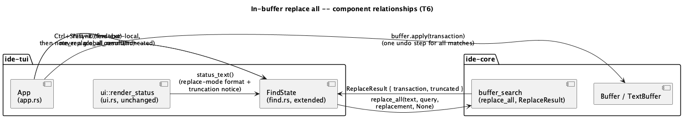
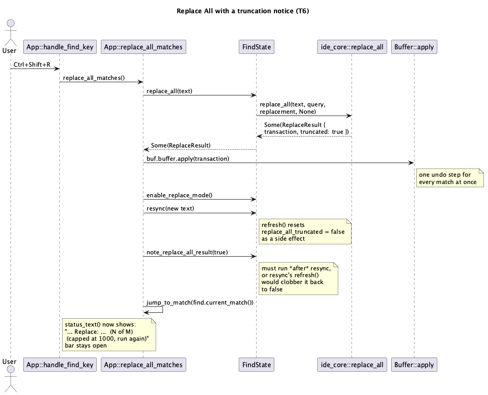

# In-buffer replace all (T6)

## 1. Purpose

Un-defers the scope cut `docs/features/tui-replace.md` §1/§4.2 made: T5
deferred Replace All because it believed no real chord existed anywhere
in this codebase's prior art to translate. That premise was wrong --
JetBrains' real macOS keymap binds `⌘⇧R` to Replace All within the
find/replace bar, and `ide-ui` was simply missing that binding, not
correctly reflecting an absence of one (`docs/features/
in-buffer-find-replace.md` §3.8, corrected alongside this doc's own
authoring). With `ide-ui`'s `CommandAction::ReplaceAll` now real, this
batch gives `ide-tui` the literal Ctrl-translation, `Ctrl+Shift+R`, using
`ide_core::replace_all` (already used by `ide-ui`'s own
`replace_all_matches`, already re-exported at the `ide_core` crate root)
-- no `ide-core` changes, no new dependency.

Out of scope, unchanged from `T5`'s own carry-forward list: regex/
whole-word/case-sensitive toggles, "in selection" scope, match-highlight
overlay, general scroll-follows-cursor fix, LSP/git/PTY integration for
`ide-tui`.

## 2. Interface / API

### 2.1 `src/find.rs`

```rust
impl FindState {
    /// Builds the whole-buffer replace transaction via
    /// `ide_core::replace_all` (literal query, no scope -- `T4`/`T5`
    /// never introduced an "in selection" concept for this crate). `None`
    /// if there is nothing to replace, mirroring `ide_core::replace_all`'s
    /// own contract. Does not mutate `self` -- the caller applies the
    /// transaction, then calls `resync` and `note_replace_all_result`.
    pub(crate) fn replace_all(&self, text: &str) -> Option<ReplaceResult>;

    /// Records whether the just-applied Replace All was capped at
    /// `ide_core::MAX_SEARCH_MATCHES` -- surfaced by `status_text` (§3.3)
    /// until the next query/replacement edit or the next Replace All
    /// clears/overwrites it. Never silenced (§4.2's "never silence"
    /// requirement, inherited from `in-buffer-find-replace.md` §2.1).
    pub(crate) fn note_replace_all_result(&mut self, truncated: bool);
}
```

`FindState` gains one new field, `replace_all_truncated: bool` (default
`false`). `refresh` (the private method `push_char`/`pop_char`/`resync`
already call for the `Query` field) resets it to `false` at the top of
its body -- a fresh live search invalidates any stale Replace-All notice,
the same "this note describes the last operation, not a sticky banner"
lifetime `T5`'s own truncation suffix already has for search-truncation.

`status_text`'s replace-mode branch (§3.3 below) appends a further
segment when `replace_all_truncated` is `true`.

### 2.2 `src/app.rs`

`handle_find_key` gains a fourth `Ctrl`-qualified check, alongside
`Ctrl+G`/`Ctrl+Shift+G`/`Ctrl+R` and checked in the same position (before
the generic `match key.code` block, for the identical reason: on a
terminal with the Kitty/CSI-u keyboard protocol active (`main.rs`, see
its own doc comment), `crossterm` reports `Ctrl+Shift+R` as
`KeyCode::Char('r')` -- **lowercase**, since the protocol reports `Shift`
as a separate modifier bit rather than folding it into the char's case --
with `modifiers: CONTROL.union(SHIFT)`):

```rust
if key.modifiers == KeyModifiers::CONTROL.union(KeyModifiers::SHIFT)
    && key.code == KeyCode::Char('r')
{
    self.replace_all_matches();
    return LoopSignal::Continue;
}
```

**Post-merge correction (2026-08-26):** this section originally matched
`KeyCode::Char('R')` (uppercase), reasoning by analogy with a plain typed
keystroke's shift-folds-into-case behavior. That's wrong for a `Ctrl`
chord: discovered live when a user's real `Ctrl+Shift+R` press did
nothing in iTerm2. `main.rs` didn't request the extended protocol needed
to disambiguate `Ctrl+Shift+<letter>` from plain `Ctrl+<letter>` at all
until this fix -- see its doc comment and `commands.rs`'s for the full
root-cause writeup, which affected every `Ctrl+Shift+*` binding in this
crate, not just this one.

**Never a global command.** Unlike `Ctrl+R` (§2.2 of `tui-replace.md`,
which *is* partly global because opening a fresh bar is a meaningful
state), Replace All has no meaningful "fresh, bar closed" behavior to
register: `Escape` fully drops `FindState` in this crate (`tui-find.md`
§2.2 -- unlike `ide-ui`'s `FindBar`, which persists `query`/`replacement`
per tab across a close, `docs/features/in-buffer-find-replace.md` §3.7),
so a closed bar has no query or replacement left to act on. A global
`Action::ReplaceAll` would therefore always either no-op (empty query) or
be unreachable (bar open, `handle_key`'s `self.find.is_some()` check
routes here instead) -- the exact "no-op-or-unreachable" shape
`tui-find.md` §4.2 already used to justify keeping `Ctrl+G`/
`Ctrl+Shift+G` find-bar-local rather than global. `Ctrl+Shift+R` follows
that same precedent, not `Ctrl+R`'s hybrid one.

**Works regardless of `replace_mode`/`field`**, mirroring `ide-ui`'s own
`is_command_enabled(ReplaceAll)` (gated only on `active_tab.is_some()`,
not on whether the replace row is visually revealed) and
`replace_all_matches` (reads `tab.find.replacement()` unconditionally,
defaulting to whatever it currently is -- empty string if the user never
revealed the row and typed one, same as this crate's `FindState::
replacement` default). Replacing every match with an empty string is
standard, expected Replace-All behavior when the replacement field was
never filled in, in both frontends alike -- not a TUI-specific risk.

New method:

```rust
fn replace_all_matches(&mut self) {
    let Some(text) = self.active_buffer().map(|b| b.buffer.text().to_string()) else {
        return;
    };
    let Some(ReplaceResult { transaction, truncated }) =
        self.find.as_ref().and_then(|f| f.replace_all(&text))
    else {
        return;
    };
    let Some(buf) = self.active_buffer_mut() else {
        return;
    };
    buf.buffer.apply(transaction);
    let new_text = buf.buffer.text().to_string();
    if let Some(find) = self.find.as_mut() {
        find.enable_replace_mode();
        find.resync(&new_text);
        find.note_replace_all_result(truncated);
    }
    let current = self.find.as_ref().and_then(FindState::current_match);
    self.jump_to_match(current);
}
```

**`resync` must run before `note_replace_all_result`, not after.**
`resync` calls the private `refresh`, which (§2.1) resets
`replace_all_truncated` to `false` at its top as a side effect of any
fresh search -- calling `note_replace_all_result` first would have its
`true` immediately clobbered back to `false` by the `resync` right after
it. This ordering is load-bearing, not incidental; a test asserting the
notice actually survives the resync it's paired with is required (§5).

`enable_replace_mode()` is called unconditionally here (even if the user
invoked `Ctrl+Shift+R` while `replace_mode` was still `false`) --
**deliberately**, so `status_text`'s replace-mode branch (the only one
that renders `replace_all_truncated`'s notice, §3.3) is always what's
visible immediately after a Replace All. This is one place this crate's
translation of `ide-ui`'s behavior isn't 1:1: `ide-ui` has a separate
`self.error` toast channel independent of the find bar's own rendering
(`in-buffer-find-replace.md` §3.8), so its keyboard dispatch has no
equivalent reason to force the replace row open. `ide-tui` has exactly
one status line (`tui-find.md` §2.4's `render_status`, unchanged by this
batch), and `find.status_text()` takes priority over `app.status()`
whenever `app.find.is_some()` -- so routing the truncation notice through
`app.status` the way `Ctrl+W`-on-a-dirty-tab does would be silently
hidden behind `find.status_text()` for as long as the bar stays open
(and it does stay open, deliberately, mirroring `ide-ui`'s own "so
Replace All can simply be invoked again" rationale). Folding the notice
into `FindState` itself, and guaranteeing the branch that renders it is
always the active one, avoids that trap without touching `render_status`
or `self.status`'s existing priority at all.

### 2.3 `src/commands.rs`

No changes. Per §2.2, `Ctrl+Shift+R` is never registered here, the same
way `Ctrl+G`/`Ctrl+Shift+G` aren't.

### 2.4 `src/ui.rs`

No changes. `render_status` already renders `find.status_text()`
unconditionally whenever `app.find` is `Some`; the new truncation
segment is picked up for free.

## 3. Behaviour

### 3.1 Triggering

`Ctrl+Shift+R` while `find` is open replaces every match of the current
query with the current replacement text, across the whole buffer, as one
undo step -- regardless of which field currently has focus, and
regardless of whether `replace_mode` was already `true`. No matches is a
no-op (nothing applied, nothing to undo). `Ctrl+Shift+R` while `find` is
closed does nothing (`handle_key` only routes to `handle_find_key`, and
by extension this check, while `self.find.is_some()`).

### 3.2 After replacing

The bar stays open (never closes, matching `ide-ui`'s "Replace All can
simply be invoked again" rationale) with `replace_mode` now `true` and
matches resynced against the buffer's new text; the view jumps to
whatever is now the first remaining match (or does nothing if none
remain).

### 3.3 The truncation notice

When the replace-all itself was capped at `ide_core::MAX_SEARCH_MATCHES`
(more matches existed than one `Transaction` will apply in a single
call), `status_text` appends a further segment after the normal
find/replace suffix:

```
▸ Find: foo    Replace: bar  (3 of 3)  (capped at 1000, run again)
```

This is a genuinely separate signal from the existing `+`-suffixed
search-truncation marker (`tui-find.md`'s `(N of M+)`) -- that one means
"the *search* stopped counting at 1000 matches"; this one means "the
*replace-all that just ran* only touched the first 1000 of what it
found." Both can appear in the same call in principle (an enormous
buffer with 2000+ occurrences replaced down to, say, 3 remaining that
still happen to match) -- §5 has a worked example. The notice is cleared
(reset to not-shown) by the next query or replacement edit, or
overwritten by the next Replace All's own fresh result -- it never lingers
past whichever of those happens first.

## 4. Constraints & invariants

1. **Never a global command** (§2.2) -- the same "no-op-or-unreachable"
   reasoning `tui-find.md` §4.2 already established for `Ctrl+G`/
   `Ctrl+Shift+G` applies here, for a different underlying reason (no
   persisted state to act on once the bar closes, rather than the
   palette-unreachability reason `Ctrl+R` itself doesn't have this
   problem for).
2. **Always transactional, one undo step for the whole operation** --
   `ide_core::replace_all` builds one `Transaction` covering every match;
   `Buffer::apply` is called exactly once, not once per match. `Ctrl+Z`
   afterward reverts all of it at once (same invariant `T5`'s single-match
   replace already established for its own, smaller transaction).
3. **`replace_all_truncated` never silences a capped replace -- it must
   be visible immediately**, which is why `enable_replace_mode()` is
   forced regardless of the field/mode the user was in before invoking
   `Ctrl+Shift+R` (§2.2's rationale). A test proving the notice is
   visible even when `Ctrl+Shift+R` is invoked from find-only mode
   (`replace_mode` still `false` beforehand) is required (§5).
4. **`FindState::replace_all` never mutates `self`** (§2.1) -- same
   pure-builder shape `replace_current` (`T5`) already established;
   `app.rs` applies the transaction, then calls `resync` and
   `note_replace_all_result` itself.
5. **A fresh query/replacement edit clears the stale notice** (§2.1) --
   `refresh` resets `replace_all_truncated` to `false` at its top, so
   typing invalidates a leftover notice from a previous Replace All the
   same way it invalidates a previous match list.

## 5. Examples

**Basic Replace All, no truncation:**

```
Ctrl+R                    -- opens in replace mode, field = Query
f o o                     -- 3 matches
Tab
b a z
Ctrl+Shift+R              -- replaces all 3 "foo"s with "baz" as one
                             undo step; status:
                             "  Find: foo  ▸ Replace: baz  (No matches)"
                             (assuming "baz" doesn't itself match "foo")
Ctrl+Z                    -- reverts all 3 replacements at once
```

**Truncated Replace All, invoked from find-only mode:**

```
Ctrl+F                    -- find-only, replace_mode still false
x                         -- matches every "x" in a buffer with well over
                             1000 of them (truncated at MAX_SEARCH_MATCHES
                             by the search itself, per T4's own "+"
                             suffix: "Find: x  (1 of 1000+)")
Ctrl+Shift+R              -- replaces the first MAX_SEARCH_MATCHES "x"s
                             with "" (the replacement field was never
                             revealed/typed into, so it's still empty) as
                             one undo step; enable_replace_mode() fires as
                             a side effect, so the bar now shows replace
                             mode with a truncation notice appended, e.g.:
                             "  Find: x  ▸ Replace:   (N of M{+})
                              (capped at 1000, run again)"
                             where N/M reflect however many "x"s remain in
                             the buffer after this pass (the implementation's
                             own tests fix concrete numbers against a real
                             fixture string; not asserted here since the
                             exact cap-boundary count depends on
                             `find_matches`'s own truncation-detection
                             mechanics, out of this batch's scope to
                             re-derive by hand)
Ctrl+Shift+R              -- run again, as the notice says, to replace
                             the rest
```

## 6. Dependencies & integration points

- No new crate dependencies.
- Depends on `ide_core::{replace_all, ReplaceResult}` (both pre-existing,
  already re-exported at the crate root, already consumed by `ide-ui`'s
  `replace_all_matches`) plus everything `T4`/`T5` already depend on. No
  `ide-core` changes.
- Depends on `ide-ui`'s `CommandAction::ReplaceAll` (`⌘⇧R`) as this
  batch's source-of-truth binding to translate -- see this doc's §1 and
  `tui-replace.md`'s post-merge correction note for why `T5` originally
  (and wrongly) believed no such binding existed.
- No security-sensitive path per `CLAUDE.md`'s existing list is touched.
  No `hacker` pass is expected for this role in this batch.

## 7. Diagrams





## Revision notes

Round 1 (self-review, `rev` documentation-review mode) raised two
controversial findings, both resolved before implementation:

- **[controversial] Should the truncation notice live in `self.status`
  instead of a new `FindState` field, since that's the generic channel
  every other status message already uses?** Resolved against: `render_
  status` gives `find.status_text()` unconditional priority over `app.
  status()` whenever the bar is open (`tui-find.md` §2.4), and this
  batch deliberately keeps the bar open after Replace All -- so a
  `self.status`-routed notice would be silently hidden for as long as
  the bar stays open, exactly the "never silence" requirement this
  notice exists to satisfy. Flipping `render_status`'s priority instead
  was considered and rejected: nothing currently clears `self.status`
  proactively when `find` opens, so a stale unrelated message could
  permanently shadow live find/replace status after the flip -- a wider,
  riskier change for a narrower problem. Keeping the notice inside
  `FindState` itself, in the one branch guaranteed active after this
  operation (`enable_replace_mode()`'s forced call, §2.2), is the
  smaller, self-contained fix.
- **[controversial] Should `Ctrl+Shift+R` require `replace_mode` to
  already be `true` (mirroring the GUI button's physical position inside
  the revealed replace row), rather than working from find-only mode
  too?** Resolved against gating: `ide-ui`'s own `is_command_enabled
  (ReplaceAll)` and `replace_all_matches` don't distinguish either --
  gated only on `active_tab.is_some()`, not on the replace row's visual
  state -- and nothing in `in-buffer-find-replace.md` suggests
  row-visibility gating was ever an intentional design constraint rather
  than simply "that's where the button happened to be placed." Inventing
  a TUI-specific restriction GUI itself doesn't enforce would be a new
  cross-frontend inconsistency, not a safety improvement -- `Ctrl+Z`
  already fully covers the "replaced with an empty string by accident"
  case, the same safety net GUI itself relies on.

No changes to the public interface or scope resulted from this round.

**Post-merge correction (2026-08-26):** `Ctrl+Shift+R` was unreachable on
any terminal without the Kitty/CSI-u keyboard protocol active -- see the
correction note inline in §2.2 above for the fix (`main.rs`'s protocol
opt-in, `app.rs`'s check now matching lowercase `Char('r')`) and
`commands.rs`'s module doc comment for the full root-cause writeup.
Discovered live: a user's real `Ctrl+Shift+R` press did nothing in
iTerm2.
