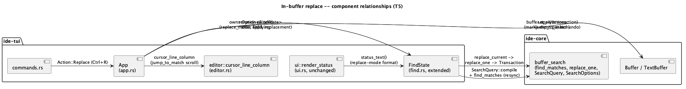
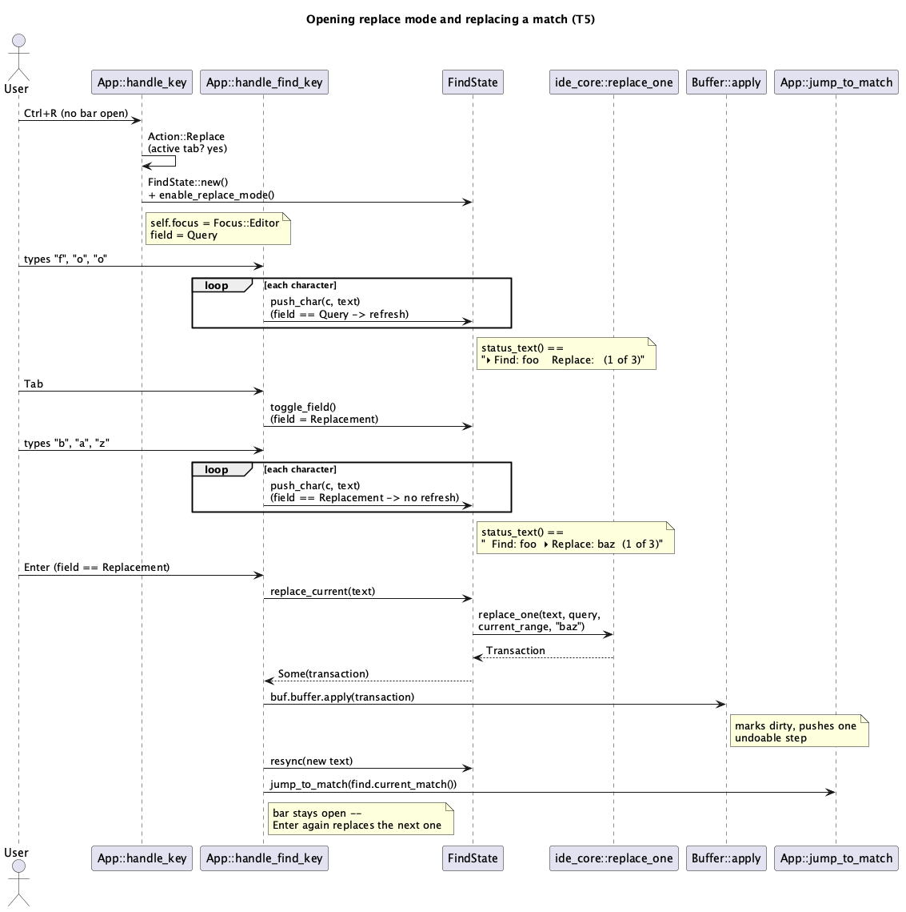

# In-buffer replace (T5)

## 1. Purpose

Closes the "no replace" scope cut `docs/features/tui-find.md` §6 named
explicitly as a deferred follow-up "once find navigation itself has been
used and validated" — `T4` is merged and exercised, so this batch adds
single-match replace on top of it. `ide-core`'s `replace_one` (already
used by `T4`'s sibling `find_matches`, and by `ide-ui`'s full panel per
`docs/features/in-buffer-find-replace.md`) is the only new API surface
this batch consumes — still no `ide-core` changes, no LSP.

**Deliberately narrower than `ide-ui`'s Replace All.** `ide-ui`'s own
"Replace All" has no keyboard shortcut at all — it's a docked panel
button click (`docs/features/in-buffer-find-replace.md` §2.3/§3.8 never
names a chord for it, only "the replace row's 'Replace All' button").
`Ctrl+G`/`Ctrl+Shift+G` are find-bar-local in this crate (`tui-find.md`
§4.2) precisely because they're the literal Ctrl-translation of a *real*
`ide-ui` binding (⌘G/⌘⇧G) that already exists to translate -- the
find-bar-local mechanism isn't itself an exemption from `CLAUDE.md`'s
"never invent a binding" rule, it's just a different place to register a
real translated binding than the global command table. Replace All has no
such source-of-truth chord anywhere in this codebase's own prior art
(`ide-ui` went through the identical "does a real IDE binding exist"
exercise and came up with a mouse-only button) -- assigning it *any* key
here, find-bar-local or global, would be inventing one from nothing, which
the rule forbids outright. (A secondary, independent obstacle: `ide-tui`'s
command palette is also *unreachable* while `find` owns key interception --
`tui-find.md` §4.1/§4.2, `handle_key`'s `self.find.is_some()` check runs
before the hardcoded `Ctrl+Shift+A` open-palette check -- so even a
"no default binding, reachable from the palette" registration would be
permanently unreachable rather than merely undiscoverable. But the binding
itself not existing is the primary reason, not this.) So this batch
implements **Replace (current match)** only, which *does* have a real,
named `ide-ui` binding (`⏎` in the replacement field,
`in-buffer-find-replace.md` §2.3's `replace_current_match` doc comment),
and defers Replace All to a later batch on the off chance a future
`ide-ui` revision ever gives it a real chord to translate.

Out of scope, same reasoning as every prior batch's scope cuts: LSP
integration, git integration, any subprocess/PTY panel (`T1`'s original
deferred list), Replace All (above), regex/whole-word/case-sensitive
toggles and "in selection" scope (`tui-find.md` §6, still unaddressed),
and match-highlight overlay (`tui-find.md` §6, still unaddressed).

## 2. Interface / API

### 2.1 `src/find.rs`

```rust
#[derive(Debug, Clone, Copy, PartialEq, Eq)]
pub(crate) enum FindField {
    Query,
    Replacement,
}

pub(crate) struct FindState {
    query: String,
    matches: Vec<Range<usize>>,
    truncated: bool,
    current: Option<usize>,
    replacement: String,
    replace_mode: bool,
    field: FindField,
}
```

`FindState::new()` is unchanged in every respect except two new fields
starting at their obvious defaults: `replacement: String::new()`,
`replace_mode: false`, `field: FindField::Query`. Every `T4` behavior
(`push_char`/`pop_char`/`next`/`prev`/`current_match`/`query`) is
preserved exactly when `replace_mode` is `false` — this batch is
additive, not a rewrite of `T4`'s find-only path.

New methods:

```rust
impl FindState {
    /// Reveals the replacement field without resetting `query`/`matches`
    /// -- mirrors `ide-ui`'s own "`⌘R` on an already-open find-only bar
    /// reveals the replace row" behavior
    /// (`in-buffer-find-replace.md` §3.1). One-way: nothing in this batch
    /// ever turns `replace_mode` back off short of closing the whole bar.
    pub(crate) fn enable_replace_mode(&mut self);

    pub(crate) fn replace_mode(&self) -> bool;

    /// Flips `field` between `Query`/`Replacement`. No-op while
    /// `!replace_mode` -- there is only one field to be on in find-only
    /// mode, so `field` never leaves `Query` in that state (`T4`'s
    /// `status_text` format for `!replace_mode` is therefore reachable
    /// and correct exactly as before, unchanged).
    pub(crate) fn toggle_field(&mut self);

    /// Builds the one-`Change` `Transaction` (via `ide_core::replace_one`)
    /// that replaces the current match with `self.replacement`. `None`
    /// if there is no current match (nothing to replace) -- the caller
    /// must not call `Buffer::apply` on `None`. Does **not** apply the
    /// transaction or touch `self.matches`/`self.current` itself --
    /// `app.rs`'s caller applies it to the real buffer, then calls
    /// `resync` (below) against the buffer's new text.
    pub(crate) fn replace_current(&self, text: &str) -> Option<ide_core::Transaction>;

    /// Re-searches `text` with the current query (identical work to what
    /// `push_char`/`pop_char` already trigger via the private `refresh`)
    /// -- exposed so `app.rs` can resynchronize `matches`/`current`
    /// against the buffer's content immediately after applying a replace,
    /// without `find.rs` needing to know anything about how the edit was
    /// made.
    pub(crate) fn resync(&mut self, text: &str);
}
```

`push_char`/`pop_char` are extended to be field-aware: `push_char`
appends to `self.query` and calls `refresh` (`T4`'s existing behavior,
unchanged) when `field == Query`; when `field == Replacement`, it
appends to `self.replacement` and does **not** call `refresh` --
editing the replacement text never changes which ranges match, only
what a match gets replaced *with*. `pop_char` is the same split,
backward.

`replace_current`'s implementation recompiles a `SearchQuery` exactly
the way the private `refresh` does (`SearchOptions::default()`, the
same `.expect`-is-sound-for-any-query-string invariant `tui-find.md`
§4.4 already established), reads `current_range = self.current_match()?`
(returning `None` immediately if there is none), and calls
`ide_core::replace_one(text, &query, current_range, &self.replacement)`.

`status_text` gains a second format for `replace_mode`. Each field is
prefixed with a 2-character marker: `"\u{25b8} "` (the same `▸` glyph
`ui.rs::render_tree` already uses for an expanded-row marker) for
whichever field `self.field` currently is, `"  "` (two spaces, equal
width) for the other:

```
{query_marker}Find: {query}  {replacement_marker}Replace: {replacement}{suffix}
```

`{suffix}` is exactly `T4`'s existing suffix logic (`"  ({n} of {m}{+})"`
/ `"  (No matches)"` / `""` for an empty query), computed identically
and simply appended at the end. When `!replace_mode`, `status_text`
returns exactly what `T4` already returns (no markers, no `Replace:`
segment) -- this branch is untouched code.

### 2.2 `src/app.rs`

```rust
// Only reachable while `self.find.is_none()` -- see below for why.
Action::Replace => {
    if self.active_buffer().is_some() {
        let mut find = FindState::new();
        find.enable_replace_mode();
        self.find = Some(find);
        self.focus = Focus::Editor;
    }
}
```

**`Ctrl+R` on an already-open bar cannot go through `Action::Replace`.**
`handle_key`'s `self.find.is_some()` check (`tui-find.md` §2.2/§4.1) runs
before `binding_for`, so `run_action` -- and `Action::Replace` with it --
is only ever reached while `self.find` is `None`. Revealing the replace
row on a bar that's already open (find-only or already replace-mode) is
therefore a **third find-bar-local `Ctrl`-qualified check** inside
`handle_find_key`, added alongside `Ctrl+G`/`Ctrl+Shift+G` and checked
before the generic `match key.code` block for the identical reason those
two are (`crossterm` reports `Ctrl+R` as the same `KeyCode::Char('r')` a
plain `r` keystroke produces):

```rust
if key.modifiers == KeyModifiers::CONTROL && key.code == KeyCode::Char('r') {
    if let Some(find) = self.find.as_mut() {
        find.enable_replace_mode();
    }
    return LoopSignal::Continue;
}
```

`handle_find_key` additionally gains two new cases, both checked in the
same position as `T4`'s existing `(NONE, Backspace)`/`(NONE, Enter)`
arms (i.e. inside the `match key.code` block, after all three
`Ctrl`-qualified checks above):

- `(NONE, Tab)`: `find.toggle_field()`.
- `(NONE, Enter)` is now field-aware instead of `T4`'s unconditional
  "jump then always close":
  - `!replace_mode` (or `replace_mode && field == Query`): jump to the
    current match via `jump_to_match` (`T4`'s existing helper, unchanged)
    -- **but only close the bar when `!replace_mode`**. In replace mode,
    `Enter` while the query field is focused just jumps and keeps the bar
    open, so the user can `Tab` to the replacement field next. This is
    `T4`'s exact behavior when `replace_mode` is `false` (unchanged code
    path, same as `status_text`'s split above).
  - `replace_mode && field == Replacement`: builds the transaction via
    `find.replace_current(text)`; if `Some(transaction)`, applies it
    (`buf.buffer.apply(transaction)` -- marks dirty and pushes one
    undoable step, `ide_core::Buffer::apply`'s own existing contract, no
    separate `mark_dirty` call needed), calls `find.resync(new_text)`
    against the buffer's post-edit text, then jumps to whatever is now
    the current match (`jump_to_match(find.current_match())`) so the bar
    stays open, positioned at the next occurrence, ready for another
    `Enter`. `None` (no current match) is a no-op -- nothing to replace.

The two `Ctrl`-qualified checks (`Ctrl+G`/`Ctrl+Shift+G`) and the
`Backspace`/`Char(c)` handling are otherwise unchanged from `T4` --
`push_char`/`pop_char` already dispatch to the right field internally
(§2.1), so `handle_find_key`'s call sites don't need to know which field
is focused.

### 2.3 `src/commands.rs`

One new entry:

```rust
Command {
    id: "Replace",
    title: "Replace",
    binding: Some((KeyModifiers::CONTROL, KeyCode::Char('r'))),
    action: Action::Replace,
},
```

`ide-ui`'s own `Replace` command binds `⌘R` -- this is that binding's
`Ctrl`-translated form, the same convention every prior `T2`/`T4` binding
already used. No conflict with the existing table (`Ctrl+R` is unused).

### 2.4 `src/ui.rs`

No changes. `render_status` already calls `find.status_text()`
unconditionally whenever `app.find` is `Some` (`tui-find.md` §2.4) --
`status_text`'s own new replace-mode branch (§2.1) is picked up for
free.

## 3. Behaviour

### 3.1 Opening in replace mode

`Ctrl+R` with an active tab and no find bar open creates a fresh
`FindState` with `replace_mode` already `true` (empty query and
replacement, exactly like `Ctrl+F`'s fresh-empty-query behavior) --
through the global `Action::Replace` (§2.2). `Ctrl+R` while the bar is
*already* open (in either mode) instead goes through `handle_find_key`'s
own local `Ctrl+R` check (§2.2) and calls `enable_replace_mode` on the
existing state -- reveals the replacement field (or is a no-op if
already revealed) without resetting `query`, `matches`, or
`replacement`. `Ctrl+F` while a replace-mode bar is already open has no
defined effect beyond `T4`'s existing "any other key combo not
explicitly handled is ignored" default -- there is no way to hide the
replacement field again short of `Escape` (closing the whole bar) and
reopening fresh with `Ctrl+F`.

### 3.2 Switching fields

`Tab` toggles `field` between `Query` and `Replacement` whenever
`replace_mode` is `true`. Typing and `Backspace` always act on whichever
field is currently focused. `Tab` while `!replace_mode` is a no-op (there
is only the query field to be on).

### 3.3 Replacing

With `field == Replacement`, `Enter` replaces the current match (if any)
with the replacement text, applies it as one undoable transaction, and
re-searches the buffer's new content -- exactly `ide-ui`'s own
documented shape ("replaces the current match, then advances to the
next one... the match list is recomputed against the now-shorter/longer
text", `in-buffer-find-replace.md` §2.3/§3.8), simplified: this batch
does not attempt `ide-ui`'s "land on the specific next match at or after
where the replaced one used to start" positional tracking -- `resync`
just resets `current` to the first remaining match (or `None`), the same
simple convention `T4`'s own `refresh` already established, not a new
one invented for this batch.

A literal (non-regex) replacement inserts the replacement text verbatim,
`$` characters included -- `ide_core::replace_one`'s own existing
contract for a non-regex query (§2.1); `T5` never sets `regex: true`
(unchanged from `T4`), so capture-group expansion (`$1`) never applies
here.

### 3.4 Undo

`Ctrl+Z` after a replace reverts it in one step, the same as any other
edit -- `Buffer::apply`'s own contract, unchanged, no special-casing
needed in this batch for undo/redo/dirty-tracking to keep working. Note
this requires closing the bar first (`Escape`): `Ctrl+Z` while `find` is
still open is swallowed by `handle_find_key`'s wildcard arm the same way
`Ctrl+W` already is (`tui-find.md` §4.1's invariant, unchanged by this
batch) -- undoing a replace mid-session is `Escape` then `Ctrl+Z`, not
`Ctrl+Z` directly.

## 4. Constraints & invariants

1. **`T4`'s find-only path is unchanged when `replace_mode` is `false`.**
   Every method's `!replace_mode` branch is either literally the same
   code `T4` already had, or (for `push_char`/`pop_char`/`status_text`)
   behaviorally identical to it -- a test suite entry proving this
   (§5) is required, not just an assumption.
2. **No Replace All in this batch** (§1) -- there is no real chord
   anywhere in this codebase's prior art to translate (`ide-ui` itself
   has no keyboard-reachable "Replace All", only a button), so assigning
   one here would be inventing a binding from nothing, which `CLAUDE.md`'s
   keybinding rule forbids outright, independent of the secondary fact
   that `ide-tui`'s command palette is also unreachable while `find` owns
   key interception (`tui-find.md` §4.1/§4.2). Deferred, not cut for being
   "extra work."
3. **`replace_current` never mutates `FindState` itself** (§2.1) -- it
   only builds a `Transaction`. All state mutation (applying the edit,
   resyncing matches, jumping) happens in `app.rs`, keeping `find.rs`'s
   pure/no-`App`-dependency contract from `T4` intact.
4. **`Enter`'s close-or-not split is the one behavior change to an
   existing `T4` key** (§2.2) -- `!replace_mode` (or
   `replace_mode && field == Query`) still jumps; only
   `replace_mode && field == Query` changed from "always closes" (`T4`)
   to "closes only when `!replace_mode`". This was considered and
   rejected the other way (keeping `Enter` an unconditional close even in
   replace mode, forcing a fresh `Ctrl+R` for every single jump-then-
   replace cycle) -- that alternative breaks the very workflow §3.1's
   worked example depends on, where the bar stays open across repeated
   "jump, tab, replace" cycles; `T4`'s close-on-`Enter` was itself tuned
   for a single-shot lookup and is the special case here, not the other
   way around. A regression test proving `T4`'s original find-only
   `Enter`-always-closes behavior still holds when `replace_mode` is
   `false` is required (§5).
5. **Replace is always transactional** (`Buffer::apply`, never a direct
   `TextBuffer` mutation) -- same invariant `in-buffer-find-replace.md`
   §4.3 already states for `ide-ui`; this batch inherits it by
   construction, not by re-deriving it.

## 5. Examples

**Opening directly into replace mode, replacing one match:**

```
Ctrl+R                   -- opens with replace_mode = true, field = Query
f o o                    -- status: "▸ Find: foo    Replace:   (1 of 3)"
Tab                      -- field = Replacement
b a z                    -- status: "  Find: foo  ▸ Replace: baz  (1 of 3)"
Enter                    -- replaces the 1st "foo" with "baz", applies as
                            one undo step, re-searches (now 2 "foo"s left,
                            assuming "baz" itself doesn't also match
                            "foo"), jumps to the new current match, bar
                            stays open
Enter                    -- replaces the (new) 1st remaining "foo"
Escape                   -- closes; two "foo"s have been replaced with
                            "baz", both as separate undo steps
```

**`FindState` in isolation (pseudocode for the unit tests §2.1 requires):**

```rust
let text = "foo bar foo";
let mut find = FindState::new();
find.push_char('f', text);
find.push_char('o', text);
find.push_char('o', text);
find.enable_replace_mode();
find.toggle_field(); // field == Replacement now
find.push_char('x', text); // replacement == "x", matches unchanged
let tx = find.replace_current(text).unwrap();
// tx replaces byte range 0..3 ("foo") with "x"
```

## 6. Dependencies & integration points

- No new crate dependencies.
- Depends on `ide_core::{replace_one, Transaction}` (`replace_one`
  pre-existing, already re-exported at the crate root and already
  consumed by `ide-ui`'s `FindBar`) plus everything `T4` already depends
  on. No `ide-core` changes.
- **Deliberate scope cuts, each with a named follow-up or explicit non-
  goal** (same pattern `T3`/`T4`'s own §6 used):
  - No Replace All (§1/§4.2) -- blocked on a future `ide-ui` revision ever
    giving it a real chord to translate; there is nothing to invent here
    without breaking the "never invent a binding" rule.
  - No `ide-ui`-style "land on the specific next match" positional
    tracking after a replace (§3.3) -- `resync` always resets to the
    first remaining match, simpler than `ide-ui`'s `refresh(text, near)`.
  - No regex/whole-word/case-sensitive toggles, "in selection" scope, or
    match-highlight overlay -- unchanged carry-forward from `tui-find.md`
    §6, still unaddressed by this batch.
- No security-sensitive path per `CLAUDE.md`'s existing list is touched
  (no subprocess, no credential handling, no new file-path source). No
  `hacker` pass is expected for this role in this batch.

## 7. Diagrams





## Revision notes

Round 1 (self-review, `rev` documentation-review mode) raised two
controversial findings and one docs nit, all resolved before
implementation:

- **[docs] `replace_current`'s `current_range` was unexplained.** Fixed:
  §2.1 now spells out `current_range = self.current_match()?`.
- **[controversial] Is "no source binding to translate" or "palette
  unreachability" the real reason Replace All is deferred?** Resolved in
  the doc's favor, with the argument reordered: the absence of any real
  chord in this codebase's prior art (`ide-ui` itself never bound one) is
  the primary blocker under `CLAUDE.md`'s "never invent a binding" rule;
  palette-unreachability is a secondary, independent obstacle, not the
  crux. §1/§4.2/§6 reworded to lead with the primary reason.
- **[controversial] Does `Enter`'s mode-conditioned close-or-not split
  read as an arbitrary special case?** Resolved in the doc's favor: the
  alternative (uniform close-on-`Enter`) would break the persistent
  "jump, tab, replace, repeat" workflow §3.1 depends on, forcing a fresh
  `Ctrl+R` per cycle. §4 invariant 4 now states this rejection explicitly
  so a future reader sees it was considered, not overlooked.

No changes to the public interface, the field/status-text formats, or the
scope cuts resulted from this round -- both controversial findings were
resolved as "the design is right, the doc's justification needed
tightening," not as design changes.

**Implementation-time correction** (caught by a failing test during
`rust-tui-dev`, not by review before code was written): the original §2.2
draft put "reveal the replace row on an already-open bar" entirely inside
`run_action`'s `Action::Replace` arm. That's unreachable there --
`handle_key`'s `self.find.is_some()` check runs before `binding_for`, so
`Action::Replace` is only ever reached while `self.find` is `None`, the
exact same ordering hazard `tui-find.md`'s own review round 1 caught for
`Ctrl+G` before any code was written. Fixed by adding a third find-bar-local
`Ctrl`-qualified check to `handle_find_key` (alongside `Ctrl+G`/
`Ctrl+Shift+G`) that calls `enable_replace_mode` directly; `Action::Replace`
now only handles the no-bar-open case. §2.2/§3.1 updated to match. A
regression test (`ctrl_r_on_an_existing_find_only_bar_reveals_replace_without_resetting_query`)
proves the fix; it failed against the original code before this
correction.

**Code review** (self-review, `rev` code-review mode, round 1, approved):
verified the fix above against the actual diff, re-verified `Buffer::apply`
already remaps every existing selection through a transaction
(`crates/core/src/text/mod.rs`'s `edit`: `self.selections =
self.selections.map(&clamped)`) -- so `jump_to_match(None)` leaving a
stale pre-replace selection in place (the "replaced the last remaining
match" case) can never point out of bounds against the new, possibly
shorter text; this was checked directly against source, not assumed.
Coverage: `app.rs` 97.68%, `find.rs` 100%, `commands.rs` 100%, all
comfortably above the 80% floor. One controversial finding: `Ctrl+R` is
now partially described by `commands.rs` (the fresh-open case) and
partially only visible inside `handle_find_key` (the reveal-on-existing-
bar case) -- unlike `Ctrl+G`/`Ctrl+Shift+G`, which are *never* in
`commands()` at all, so a future reader scanning `commands.rs` alone
could miss that `Ctrl+R` does anything beyond opening a fresh bar.
Resolved in the design's favor: `Replace` has two genuinely distinct
triggering scenarios (bar closed vs. already open) that `Find` doesn't,
since `Ctrl+F` on an already-open bar has no additional behavior beyond
`T4`'s existing no-op wildcard -- the split is the minimum necessary
consequence of that asymmetry, not an inconsistency introduced by this
batch. No changes made as a result. No blocking findings; no security
checklist items apply beyond N/A (no external input, no subprocess, no
crypto, no network -- purely in-buffer editing logic).

**Post-merge correction (user-supplied fact, 2026-08-26):** §1's "no
real chord anywhere in this codebase's own prior art" premise for
deferring Replace All was wrong -- JetBrains' real macOS keymap binds
`⌘⇧R` to Replace All within the find/replace bar, and `ide-ui` itself
was simply missing that binding (button-only), not correctly reflecting
an absence of one. `ide-ui` has since been corrected
(`CommandAction::ReplaceAll`, `⌘⇧R`, `docs/features/
in-buffer-find-replace.md` §3.8). This crate's own Replace All is no
longer blocked and is scoped as a follow-up batch
(`docs/features/tui-replace-all.md`, `T6`) using `Ctrl+Shift+R` as that
binding's literal Ctrl-translation. §1/§4.2/§6's "deferred, blocked on a
future ide-ui revision" language is superseded by this note -- left
in place rather than rewritten, since it accurately records what was
believed and why at the time.

**Post-merge correction (2026-08-26):** discovered live (a user's real
`Ctrl+Shift+R` press did nothing in iTerm2, which traced back to this
crate's `Ctrl+Shift+G` sharing the same root cause) -- `Ctrl+Shift+G` was
unreachable on any terminal without the Kitty/CSI-u keyboard protocol
active, since a bare terminal computes `Ctrl+<char>` in a way that
discards case entirely, making `Ctrl+Shift+<letter>` indistinguishable
from plain `Ctrl+<letter>` at the byte level. `main.rs` now opts into
that protocol when supported (see its own doc comment), and `app.rs`'s
`Ctrl+Shift+G` check now matches the **lowercase** `Char('g')` the
protocol actually reports (`Shift` arrives as a separate modifier bit,
not folded into the char's case) rather than `Char('G')`. Full
root-cause writeup in `commands.rs`'s module doc comment and
`tui-find.md`'s own revision notes, where this binding is actually
implemented.
