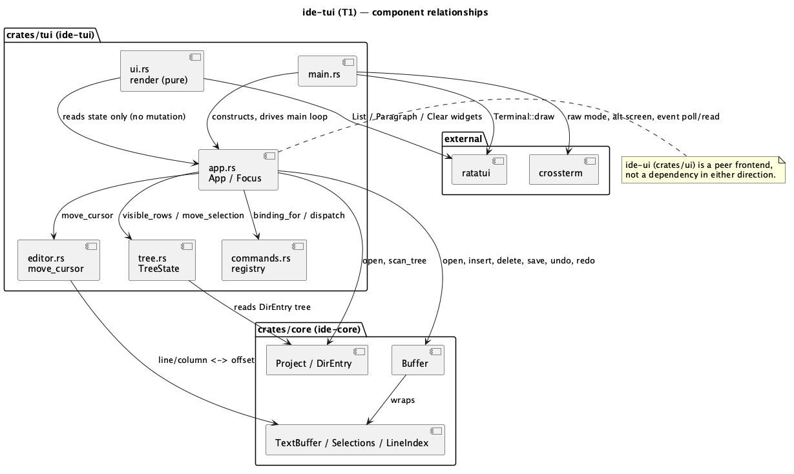
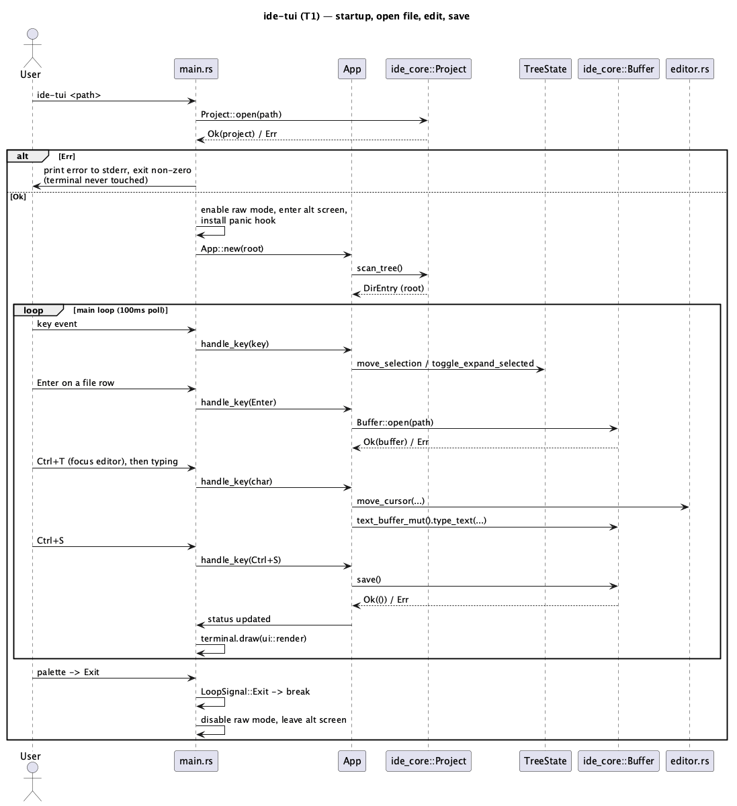

# TUI shell + directory tree + single-buffer editor (T1)

## 1. Purpose

`ide-tui` is a second, independent frontend over `ide-core` — a
`ratatui`/`crossterm` terminal application offering the same underlying
editing model as `ide-ui` (the `egui`/`eframe` GUI) for a user who wants an
IDE inside a terminal (SSH session, no display server, or personal
preference). Per `CLAUDE.md`'s dev-chain role list, `ide-tui` and `ide-ui`
are peers: neither depends on the other, both depend only on `ide-core`
(and, in later batches, `ide-lsp`/`ide-dap`).

This is the **first** TUI batch (`T1`, to avoid colliding with
`docs/roadmap.md` track G's existing `G1`–`G7` numbering) — broad parity
with `ide-ui` is the long-run target, reached through a sequence of scoped
batches the same way the GUI itself was (`docs/roadmap.md` §7), not in one
run. `T1` scopes down to: an application shell with correct terminal
setup/teardown, a directory-tree pane, a single-buffer plain-text editor
pane, and a minimal command registry/palette — enough to open a project,
navigate its files, edit and save one at a time. Explicitly **out of
scope** for `T1` (deferred to later TUI batches, each its own doc):
multiple open buffers/tabs, syntax highlighting, LSP integration, search,
git integration, asynchronous directory scanning, and any subprocess/PTY
panel. Each of these mirrors a GUI capability `ide-ui` already has, added
to the TUI incrementally the same way `docs/roadmap.md`'s own phase
sequence added them to the GUI.

## 2. Interface / API

`ide-tui` is a new crate (`crates/tui/`, package `ide-tui`, binary
`ide-tui` — deliberately distinct from `ide-ui`'s `ide` binary so both can
coexist on one `PATH`). Its only consumer is a human at a terminal; it
exposes no library API of its own beyond what its internal modules need
to be independently unit-testable. Module layout:

### 2.1 `src/main.rs`

```rust
fn main() -> std::process::ExitCode
```

- Parses `std::env::args()`: an optional single positional argument, the
  project root to open (default: the current working directory,
  `std::env::current_dir()`).
- Installs a panic hook (via `std::panic::set_hook`) that restores the
  terminal (disables raw mode, leaves the alternate screen) **before**
  printing the panic message, so a panic never leaves the user's real
  shell stuck in raw/alternate-screen mode with the panic message
  invisible or the prompt unusable.
- Enables raw mode, enters the alternate screen, constructs a
  `ratatui::Terminal<CrosstermBackend<Stdout>>`.
- Constructs `App::new(root)`; on `Err`, restores the terminal first (raw
  mode + alternate screen — the panic hook doesn't run for a returned
  `Err`, only for a panic), then prints the error to stderr and returns a
  non-zero `ExitCode`.
- Runs the main loop (§3.2) until it returns, then always restores the
  terminal (raw mode + alternate screen) before the process exits, success
  or failure alike.

### 2.2 `src/app.rs`

```rust
pub struct App {
    project_root: PathBuf,
    tree: ide_core::DirEntry,
    tree_state: TreeState,
    focus: Focus,
    buffer: Option<OpenBuffer>,
    palette: Option<PaletteState>,
    status: Option<String>,
}

pub enum Focus { Tree, Editor }

struct OpenBuffer {
    path: PathBuf,
    buffer: ide_core::Buffer,
    scroll: u16,
}

pub enum LoopSignal { Continue, Exit }

impl App {
    pub fn new(root: PathBuf) -> Result<Self, ide_core::ProjectError>;
    pub fn handle_key(&mut self, key: crossterm::event::KeyEvent) -> LoopSignal;
    pub fn status(&self) -> Option<&str>;
}
```

- `App::new` calls `ide_core::Project::open(&root)` then `.scan_tree()`
  once, synchronously, storing the result in `tree`. **Deliberately
  synchronous** for `T1` (see §6 for why this is an accepted, documented
  scope cut rather than an oversight — `ide-ui` made the identical call
  for its own first pass and fixed it in a dedicated later batch,
  `docs/features/async-tree-scan.md`; the same follow-up is expected here
  once `T1` lands).
- `handle_key` is the single entry point the main loop calls per key
  event. If `self.palette.is_some()`, it routes the key to the palette
  first regardless of `focus` (the palette is modal — see §3.5).
  Otherwise it first calls `commands::binding_for(key)`; a `Some(action)`
  is matched inline against `Action`'s variants (`SaveActive` →
  `self.buffer`'s `.save()`, `Undo`/`Redo` → the buffer's `.undo()`/
  `.redo()`, `ToggleTreeFocus` → flips `self.focus`, `Exit` → returns
  `LoopSignal::Exit`) — there is no separate `dispatch` method, this
  match lives directly in `handle_key`. A `None` (no registry binding
  matched) falls through to `self.focus`-specific handling: tree
  navigation (§3.3) or editor input (§3.4).
- `LoopSignal::Exit` is returned only when the `Exit` command actually
  runs (§2.4) — the sole way this loop ends short of a panic or a
  terminal-level SIGINT/SIGTERM the OS itself delivers.

### 2.3 `src/tree.rs`

```rust
pub struct TreeRow {
    pub path: PathBuf,
    pub depth: usize,
    pub is_dir: bool,
    pub expanded: bool,
}

pub struct TreeState {
    expanded: HashSet<PathBuf>,
    selected: usize,
}

impl TreeState {
    pub fn new() -> Self;
    pub fn visible_rows(&self, root: &ide_core::DirEntry) -> Vec<TreeRow>;
    pub fn move_selection(&mut self, root: &ide_core::DirEntry, delta: isize);
    pub fn toggle_expand_selected(&mut self, root: &ide_core::DirEntry);
    pub fn selected_row<'a>(&self, rows: &'a [TreeRow]) -> Option<&'a TreeRow>;
}
```

- `visible_rows` flattens `root` depth-first into the rows currently
  visible given `expanded` — a directory not in `expanded` contributes its
  own row but none of its children's. Root itself is never a row (its
  children start at `depth = 0`).
- `move_selection` clamps `selected` to `0..visible_rows(root).len()`
  (a no-op on an empty tree).
- `toggle_expand_selected`: if the selected row is a directory, flips its
  membership in `expanded`; a no-op on a file row.
- Pure, deterministic, fully unit-testable without any terminal or
  filesystem I/O beyond the `DirEntry` tree already passed in.

### 2.4 `src/commands.rs`

```rust
pub struct Command {
    pub id: &'static str,
    pub title: &'static str,
    pub binding: Option<(crossterm::event::KeyModifiers, crossterm::event::KeyCode)>,
    pub action: Action,
}

pub enum Action { SaveActive, Undo, Redo, ToggleTreeFocus, Exit }

pub fn commands() -> &'static [Command];
pub fn binding_for(key: crossterm::event::KeyEvent) -> Option<Action>;
```

`commands()` is `T1`'s entire registry — five entries, each an id/title
pair carried over verbatim from `ide-ui`'s own `crates/ui/src/command.rs`
registry (see §6 for why this is a deliberately small, hand-carried
subset rather than a shared crate):

| id | title | binding | carried from `ide-ui`'s `command.rs` |
|---|---|---|---|
| `SaveAll` | Save | `Ctrl+S` | `SaveAll`, mac `⌘S` (this batch's `Action::SaveActive` — named for what it actually does, since `T1` only ever has one buffer open — keeps the id `SaveAll` purely so it's traceable back to `ide-ui`'s registry entry) |
| `Undo` | Undo | `Ctrl+Z` | `Undo`, mac `⌘Z` |
| `Redo` | Redo | `Ctrl+Shift+Z` | `Redo`, mac `⌘⇧Z` |
| `ToggleProjectToolWindow` | Project | `Ctrl+T` (was `Ctrl+1` -- see Revision notes) | `ToggleProjectToolWindow`, mac `⌘1` |
| `Exit` | Exit | *(none)* | **new** — no JetBrains IDE binds this (macOS delegates to the OS `⌘Q`/Quit menu item, which `ide-ui` itself uses via `muda`'s `PredefinedMenuItem::quit`); a terminal app has no such OS-level menu to delegate to, so per `CLAUDE.md`'s keyboard-shortcuts rule ("if it doesn't exist [in a JetBrains IDE], register the command with no default binding") this is genuinely unbound by default, reachable only via the palette (§3.5) |

Every other id in this table reuses the **exact same chord `ide-ui`'s own
registry already assigns**, translated from `{mac, other}` down to a single
binding: a terminal app receives modifier chords through the terminal
emulator, not the OS window layer, and `Ctrl`-chords are the combination
essentially every terminal emulator forwards reliably regardless of host
OS — `Cmd`-chords are frequently intercepted by the terminal emulator
itself (tab switching, window management) before they ever reach the
child process. `T1` therefore always uses the binding `CLAUDE.md` calls
`other`, even on macOS — a deliberate, documented interpretation of the
existing `{mac, other}` convention for a terminal frontend, not a new rule.
This is not "inventing a binding": every id above already has a real
JetBrains-derived chord in `ide-ui`'s registry; `T1` reuses it.

`binding_for` is a pure lookup (`commands().iter().find(...)`), unit
tested directly.

Arrow-key cursor/selection movement (tree and editor alike), `Enter`
to open a file/toggle a directory, printable-character insertion, and
`Backspace`/`Delete` are **not** entries in this table — the same way
`ide-ui`'s own registry has no entries for raw arrow-key or printable-char
handling (those are inherent widget behaviour, not rebindable commands, in
both frontends alike).

### 2.5 `src/editor.rs`

```rust
pub fn cursor_line_column(buffer: &ide_core::TextBuffer, offset: usize) -> (usize, usize);
pub fn offset_for_line_column(buffer: &ide_core::TextBuffer, line: usize, column: usize) -> usize;
pub fn move_cursor(
    buffer: &ide_core::TextBuffer,
    offset: usize,
    desired_column: Option<usize>,
    direction: Direction,
) -> (usize, Option<usize>);

pub enum Direction { Left, Right, Up, Down }
```

- `cursor_line_column`/`offset_for_line_column` convert between a byte
  offset and a `(line, column)` pair where `column` is a **`char` count**
  from the start of the line — deliberately *not* the same unit as
  `ide_core`'s own `LineIndex::position_at`/`offset_at`, which are
  byte-based and perform no boundary validation at all (`offset_at` is a
  raw `line_start + column` with no clamping — see that function's own doc
  comment). Built directly:
  - `cursor_line_column(buffer, offset)`: `let (line, byte_col) =
    buffer.lines().position_at(offset);` then counts `char`s in
    `buffer.line_text(line).unwrap()[..byte_col]` to get the `char`
    column. (`byte_col` is guaranteed on a `char` boundary already, since
    `offset` itself always is — see §4 — and `position_at` only subtracts
    `line_start`, which can't cross a multi-byte character.)
  - `offset_for_line_column(buffer, line, column)`: clamps `line` to
    `buffer.lines().line_count() - 1` if out of range, walks
    `buffer.line_text(line)`'s `char`s to find the byte offset of the
    `column`-th one (clamping `column` to that line's own `char` count if
    it's longer), then returns `buffer.lines().line_start(line).unwrap() +
    that_byte_offset`.
  - Going through `char`s on the way in and out is what keeps every offset
    this module produces on a real `char` boundary — using
    `position_at`/`offset_at`'s byte columns directly for a *sticky*
    column carried across two lines with different multi-byte-UTF-8
    layouts would risk landing mid-character on the second line, which
    would panic the first time that offset is used to slice a `&str` (and
    would violate this doc's own §4 invariant).
- `move_cursor` implements `Left`/`Right` (one `char` step, clamped to
  `0..=buffer.len()`, never landing mid-UTF-8-character) and `Up`/`Down`
  (moves to the adjacent line, at `desired_column` if given — a sticky
  column carried across consecutive vertical moves, cleared by any
  `Left`/`Right`/insert/delete, the same sticky-column behaviour
  `crates/ui/src/editor/mod.rs`'s `desired_column` already implements for
  the GUI — clamped to that line's own `char` count if shorter). `Up` on
  line 0 and `Down` on the last line are no-ops: same offset returned,
  `desired_column` unchanged. Returns the new offset and the
  `desired_column` to carry forward (only vertical moves set it; `None`
  otherwise, meaning "use the current column next time").
- This module is new, `ide-tui`-local logic — it does **not** reuse
  `crates/ui/src/editor/mod.rs`'s `cursor_line_column`/geometry helpers,
  which are `egui`-glyph-layout-specific (`galley`/`CCursor`) and out of
  this role's scope to depend on (`crates/ui/**` is off-limits). Both
  frontends independently implement the same *behaviour* against the same
  `ide_core::TextBuffer`/`LineIndex` primitives.

### 2.6 `src/ui.rs` (rendering, pure — see §7 for its coverage exemption)

```rust
pub fn render(frame: &mut ratatui::Frame, app: &App);
```

Draws, per frame, from `app`'s current state only (no mutation): a left
`ratatui::widgets::List` for the tree (§3.3), a right `Paragraph` for the
active buffer's text with the cursor drawn via `frame.set_cursor_position`
(§3.4), a bottom status line (`app.status()`, or the active buffer's path
+ a `*` dirty marker when there's no transient status message), and, when
`app.palette` is `Some`, a centered floating overlay (`Clear` widget then
a bordered `List` of filtered command titles) on top of everything else.

## 3. Behaviour

### 3.1 Startup

`ide-tui [path]` opens `path` (default: cwd) as a project. If
`ide_core::Project::open` fails (not a directory, permission error), print
the error's `Display` text to stderr and exit non-zero **before** entering
raw mode / the alternate screen — a startup failure should look like any
other CLI tool's error, not corrupt the user's terminal state first.

### 3.2 Main loop

```
loop {
    if crossterm::event::poll(Duration::from_millis(100))? {
        match crossterm::event::read()? {
            Event::Key(key) => match app.handle_key(key) {
                LoopSignal::Continue => {}
                LoopSignal::Exit => break,
            },
            Event::Resize(..) => {} // ratatui redraws against the new size next iteration regardless
            _ => {}
        }
    }
    terminal.draw(|f| ui::render(f, &app))?;
}
```

The `100ms` poll timeout exists so the loop can (in a later batch, once
one exists) also check a background channel each iteration — `T1` itself
has no background work, so this is forward-structuring, not dead code: it
matches the polling shape `docs/features/async-tree-scan.md` and
`ide-ui`'s panel-poll pattern already use, for the batch that adds
asynchronous scanning here too (§6).

`crossterm::event::KeyEventKind` matters on Windows/some terminals, which
report both a key-down and key-up event for the same physical press —
`handle_key` only acts on `KeyEventKind::Press` (ignoring `Release`/
`Repeat`... actually `Repeat` **is** acted on, same as `Press`, so holding
a key down keeps moving the cursor/repeating input; only `Release` is
ignored). Getting this wrong (acting on every `KeyEventKind`) would
double-apply every keystroke on the platforms that report both press and
release as separate events.

### 3.3 Tree pane

`TreeState::visible_rows` renders as a `ratatui::widgets::List`, one line
per `TreeRow`, indented `depth * 2` spaces, a `▸`/`▾` glyph prefix for a
collapsed/expanded directory (no glyph for a file row), the selected row
highlighted. When `Focus::Tree`:
- `Up`/`Down`: `TreeState::move_selection(±1)`.
- `Enter` on a directory row: `toggle_expand_selected`.
- `Enter` on a file row: attempt to open it (§3.4). If the active buffer
  is dirty, do **not** switch — set `app.status` to a message saying so
  (e.g. `"unsaved changes in <path> -- save first (Ctrl+S)"`) and leave
  both the tree selection and the open buffer exactly as they were. `T1`
  has no discard/revert command, so this is the only way to avoid silent
  data loss when switching files with unsaved edits, matching this
  project's standing "no silent data loss" rule.

### 3.4 Editor pane

Single active buffer (`Option<OpenBuffer>`, `None` until the user opens a
file — the pane shows a placeholder message, e.g. `"No file open --
select one from the tree"`, when empty). Opening a file:
`ide_core::Buffer::open(path)`, mapping an `Err` to `app.status` (the
error's `Display` text) without touching the previously-open buffer.

When `Focus::Editor` and a buffer is open:
- `Left`/`Right`/`Up`/`Down`: `editor::move_cursor` against
  `buffer.text_buffer()`, updating the single caret via
  `buffer.text_buffer_mut().set_selections(Selections::single(Selection::caret(new_offset)))`.
- A printable character: `buffer.text_buffer_mut().type_text(&c.to_string())`
  (inserts at the current selection, matching `TextBuffer::type_text`'s
  existing "insert at selections" semantics — reused exactly as `ide-ui`
  already uses it, not reimplemented).
- `Enter`: `type_text("\n")`. `Tab` (`crossterm::event::KeyCode::Tab`, a
  distinct variant from `Char`, so not covered by "a printable character"
  above): `type_text("\t")` — inserted literally, same as any other
  unregistered key `T1` doesn't special-case. Indent-aware Tab handling is
  a later batch's concern, the same way `ide-ui`'s own smart-editing
  phase (`A4a`) came after its first editor pass.
- `Backspace`: delete the one character immediately before the caret (a
  no-op at offset 0); `Delete`: delete the one character immediately after
  the caret (a no-op at end-of-buffer). Both go through
  `buffer.delete(range)` (from `ide_core::Buffer`, which — per its own
  existing contract from `docs/features/perf-baseline.md`'s benchmark
  code, already exercised in this codebase — clamps both ends to the
  nearest valid UTF-8 char boundary, so this module never has to compute
  char-boundary-safe ranges itself).
- Any edit (insert or delete) clears `desired_column` (§2.5) and marks the
  buffer dirty (`ide_core::Buffer` tracks this internally; `OpenBuffer`
  doesn't duplicate the flag).
- Scrolling: `OpenBuffer.scroll` is a plain line offset, adjusted only
  enough to keep the caret's line inside the pane's visible row range
  (recomputed each frame from the pane's known height, not incrementally
  tracked) — clamped to `0..=total_lines.saturating_sub(1)`.

`Ctrl+S` (the `SaveAll` action, §2.4) calls `buffer.save()`; an `Err` sets
`app.status` to the error's `Display` text and leaves the buffer marked
dirty (never silently treated as saved). `Ctrl+Z`/`Ctrl+Shift+Z` call
`buffer.undo()`/`buffer.redo()` (both already handle "nothing to undo/
redo" internally by returning `false`, which this module treats as a
no-op, not an error).

### 3.5 Palette

`Ctrl+Shift+A` opens `PaletteState { query: String, filtered: Vec<&'static Command>, selected: usize }`
as a modal overlay: every subsequent key event goes to the palette first
regardless of `app.focus`, until it closes. `Exit` (§2.4, unbound
directly) is reachable only this way. Typing filters `commands()` by
substring match against `title` (case-insensitive); `Up`/`Down` move
`selected`; `Enter` runs the selected command's `Action` then closes the
palette; `Esc` closes it without running anything. Closing (either way)
restores key routing to `app.focus`. `Esc`-to-close is treated as inherent
overlay/dialog behaviour, the same as any modal in `ide-ui`, not a
registry entry (§2.4 already excludes non-command keys on the same
grounds).

### 3.6 Exit

The `Exit` action (only reachable via the palette, §2.4/§3.5) sets
`LoopSignal::Exit`. It does **not** check for a dirty buffer and does not
prompt — `T1` has no confirmation-dialog machinery yet, so exiting with
unsaved changes silently discards them. This is flagged explicitly as a
known `T1` gap (§6), not a silent omission: the fix (an "unsaved changes,
exit anyway?" prompt) is small but is genuine new UI machinery this batch
doesn't otherwise need, deferred to the same follow-up batch that revisits
this behaviour.

## 4. Constraints & invariants

- Every byte offset this crate hands to `ide_core::Buffer`/`TextBuffer`
  APIs (`insert`, `delete`'s range bounds, `Selection::caret`) is produced
  by `editor::move_cursor`/`offset_for_line_column`, never by raw
  arithmetic on `KeyCode` values — this is what keeps every offset a valid
  UTF-8 char boundary (`ide_core::Buffer::delete` clamps defensively, but
  `insert`/`Selection::caret` do not documented-clamp, so producing an
  invalid offset here would be this crate's bug, not `ide-core`'s).
- The terminal is restored (raw mode off, alternate screen left) on
  **every** exit path: normal `Exit`, a `Project::open`/`App::new` startup
  failure, and a panic (via the panic hook). Losing this on any path is a
  `[quality]`-or-worse finding in review, not a nitpick (§2.1).
- `handle_key`/`TreeState`/`editor` module functions take no `&mut
  Terminal`/`Frame` and perform no I/O beyond what's explicitly listed
  above (buffer open/save) — this is what keeps them unit-testable without
  a real terminal.
- `App::new`'s directory scan is synchronous and runs once at startup; no
  code path re-scans automatically on external filesystem change in `T1`
  (no file watcher wired in yet — that's `ide-ui`'s already-landed
  `G6`/`file-watcher.md`, not yet ported to this frontend).
- Single buffer, single cursor (no multi-cursor, no selection ranges
  beyond the collapsed caret `Selection::caret` already produces) — `T1`
  never constructs a `Selections` with more than one `Selection` or a
  non-empty range.

## 5. Examples

**Opening a project and editing a file:**

```
$ ide-tui ~/code/my-project
```

renders the tree pane focused (`Focus::Tree`) with `~/code/my-project`'s
top-level entries. `Down`, `Down`, `Enter` on a file row opens it into the
editor pane; `Ctrl+T` moves focus to the editor; typing edits the buffer;
`Ctrl+S` saves; `Ctrl+Shift+A` then typing `exit` then `Enter` quits.

**Programmatic (test) use of the pure modules**, e.g. `tree.rs`:

```rust
let mut state = TreeState::new();
let root = project.scan_tree();
let rows = state.visible_rows(&root);
assert!(rows.iter().all(|r| r.depth == 0)); // nothing expanded yet
state.toggle_expand_selected(&root); // no-op if the selected row is a file
let rows = state.visible_rows(&root);
assert!(rows.len() >= 1);
```

## 6. Dependencies & integration points

- New crate `crates/tui/` added to the workspace (root `Cargo.toml`'s
  `members`), new dependencies `ratatui` and `crossterm` (both approved,
  `CLAUDE.md`'s dependency table).
- Depends on `ide_core::{Project, ProjectError, DirEntry, DirEntryKind,
  Buffer, BufferError, TextBuffer, Selection, Selections, LineIndex}` —
  all pre-existing public API, no `ide-core` changes needed for `T1`.
- **Deliberate scope cuts, each with a named follow-up batch:**
  - Synchronous `scan_tree` at startup (§2.2) — acceptable for `T1`
    because it only runs once, at startup, before the terminal has
    anything to show yet (unlike `ide-ui`'s original bug, which
    re-scanned on every project switch mid-session); still worth
    threading off the main loop once this frontend has a project-switch
    command, mirroring `docs/features/async-tree-scan.md`.
  - No exit confirmation on a dirty buffer (§3.6).
  - No multi-buffer/tabs, no syntax highlighting, no LSP, no search, no
    git, no PTY/subprocess panel — each is its own later `T`-numbered
    batch, the same granularity `docs/roadmap.md`'s GUI tracks used.
  - `commands()` (§2.4) hand-carries five id/title/binding tuples from
    `ide-ui`'s `crates/ui/src/command.rs` rather than sharing one registry
    across both frontends. A shared registry (hoisted into `ide-core` or
    a new small shared crate) would remove the risk of the two tables
    drifting apart as both grow, but restructuring `ide-ui`'s existing
    registry is out of scope for a batch whose job is standing up
    `ide-tui` for the first time — worth revisiting once the TUI's own
    registry grows past a handful of entries.
- No security-sensitive path per `CLAUDE.md`'s existing list is touched by
  `T1` (no subprocess spawn, no credential handling, no git-remote code —
  `Project::open`'s own symlink-escape validation, already covered under
  `crates/core/src/project/**`'s listing, is the only security-relevant
  logic in this data flow, and it's unmodified `ide-core` code this crate
  merely calls). No `hacker` pass is expected for this role in this batch.

## 7. Diagrams





## Revision notes

First `rev` pass (`changes_needed`) found one correctness-blocking gap and
several doc-clarity gaps, all fixed in place:

- §2.5 originally specified `cursor_line_column`/`offset_for_line_column`
  as char-count-column functions without reconciling that with the real
  underlying primitive, `ide_core`'s `LineIndex::position_at`/`offset_at`,
  which is byte-based and does zero boundary validation. As originally
  written, a sticky vertical cursor move across lines with different
  multi-byte-UTF-8 layouts could produce an offset that lands mid-
  character — violating this doc's own §4 invariant and risking a panic.
  Rewrote §2.5 to derive both functions from `LineIndex`'s byte columns
  plus a `char`-walk over `TextBuffer::line_text` (both already-public
  `ide-core` API), which is what actually guarantees every offset lands on
  a real `char` boundary. Also added the previously-missing `Up`-on-line-0/
  `Down`-on-last-line no-op behavior.
- §2.2 now states explicitly where `Action` dispatch happens (inline in
  `handle_key`, no separate `dispatch` method) — previously implied by §3
  but never actually declared in the interface.
- §2.4's table now explains why the `SaveAll` id maps to
  `Action::SaveActive` (T1 only ever has one buffer open) instead of
  reading as an unexplained inconsistency.
- §3.5's opening sentence was garbled (conflated the palette's own
  open-binding with `Exit`'s reachability through it) — split into two
  clear sentences.
- §3.4 now specifies `Tab`'s behavior (inserts a literal `\t`), previously
  unmentioned despite not falling under "a printable character."

**Post-merge correction (2026-08-26):** `ToggleProjectToolWindow`'s original
`Ctrl+1` binding was unreachable on a real terminal, discovered live by the
user in iTerm2 (pressing it produced no focus change at all). §2.4's own
"every `Ctrl`-chord is forwarded reliably" claim turns out to be true only
for `Ctrl+<letter>`: a terminal computes `Ctrl+<char>` by masking the
character's low 5 bits, and `'1'` (`0x31`) masks to `0x11` -- the identical
byte `Ctrl+Q` produces (`'Q'` also masks to `0x11`). With no C0 control code
of its own, `Ctrl+<digit>` is indistinguishable from some `Ctrl+<letter>` at
the byte level unless the terminal and app both opt into an extended
protocol (Kitty keyboard protocol / CSI-u), which this crate never enables
(`main.rs` calls plain `enable_raw_mode()`, no
`PushKeyboardEnhancementFlags`). Rebound to `Ctrl+T` ("Tree") in
`commands.rs` -- an unused `Ctrl+<letter>` with its own unambiguous control
byte. This is the only `Ctrl+<digit>` binding this crate ever had.

That investigation surfaced a second, related bug in the same table:
`Redo`'s `Ctrl+Shift+Z` (and `handle_key`'s inline `Ctrl+Shift+A` open-
palette check, §3.5) were *also* unreachable on a plain terminal, for a
different reason -- masking discards case as well as the digit/letter
distinction, so `Ctrl+Shift+<letter>` collapses onto the same byte as
plain `Ctrl+<letter>`. `main.rs` now opts into the Kitty/CSI-u protocol
when the terminal supports it (see its own doc comment), which
disambiguates this; `commands.rs`'s and `app.rs`'s checks were updated to
match the **lowercase** codepoint the protocol actually reports
(`Char('z')`/`Char('a')`, not `Char('Z')`/`Char('A')`) -- full writeup in
`commands.rs`'s module doc comment. On a terminal without the protocol,
these two bindings remain exactly as unreachable as before; `NextTab`/
`PreviousTab`'s `Ctrl+Shift+[`/`Ctrl+Shift+]` were never affected by this
second bug (brackets aren't letters, so no case-folding applies).
