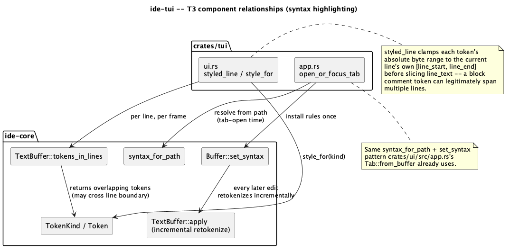
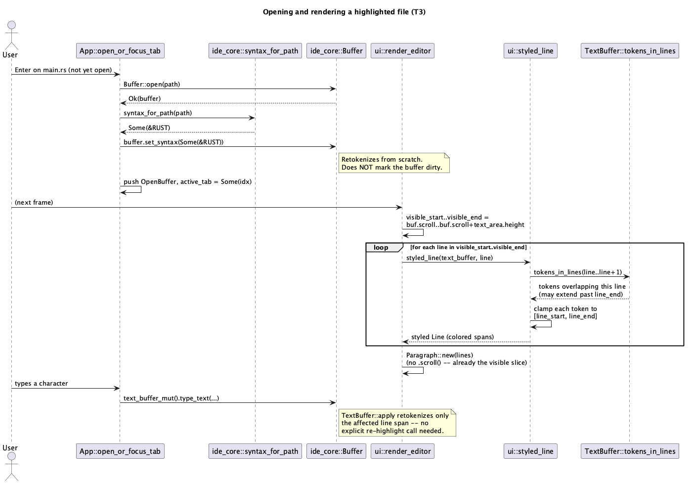

# Syntax highlighting (T3)

## 1. Purpose

Closes the "syntax highlighting" item from `T1`'s explicitly deferred
list (`docs/features/tui-shell-and-editor.md` §1). `ide-core` already
ships a complete, pure-Rust regex tokenizer (`crates/core/src/syntax.rs`,
`docs/features/syntax-highlighting.md`) that `ide-ui` already drives
end-to-end (`crates/ui/src/app.rs`'s `syntax_for_path` + `Buffer::set_syntax`
at tab-open time, `TextBuffer::tokens_in_lines` per row at render time).
`T3` wires the exact same `ide-core` API into `ide-tui`'s tab-open and
render paths — no new tokenizer, no new `ide-core` code, no LSP. Semantic
highlighting (`docs/features/semantic-highlighting.md`, LSP-driven,
overrides the regex tokenizer where a server disagrees) is a distinct,
still-deferred later item in `T1`'s own list — `T3` only ever consumes the
regex tokenizer's output, the same fallback layer `ide-ui` falls back to
when no server is attached.

Out of scope, same reasoning as every prior batch's scope cuts: LSP
integration, search, git integration, asynchronous directory scanning,
any subprocess/PTY panel (all still on `T1`'s original deferred list), and
viewport-limited re-rendering (§6 — `ide-tui`'s editor pane already
renders the whole buffer as one scrollable `Paragraph`, unchanged since
`T1`; `T3` doesn't change that architecture, just adds per-token color to
what's already rendered in full every frame).

## 2. Interface / API

### 2.1 `src/app.rs`

`open_or_focus_tab`'s not-found branch (`docs/features/
tui-multi-buffer-tabs.md` §2.1) installs syntax immediately after
`Buffer::open` succeeds, before the new tab is pushed:

```rust
let mut buffer = Buffer::open(&path)?;
buffer.set_syntax(ide_core::syntax_for_path(&path));
```

Exactly the pattern `crates/ui/src/app.rs` already establishes at its own
tab-open site (`syntax_for_path` resolved once from the path, `set_syntax`
called once) — `Buffer::set_syntax` is its own already-existing `ide-core`
API (`crates/core/src/buffer.rs`), documented to retokenize from scratch
and to **not** mark the buffer dirty ("choosing a language is not an
edit"), so this needs no `mark_dirty` call and doesn't interact with `T1`'s
established dirty-tracking rules at all. `syntax_for_path` returns `None`
for an unrecognized extension, which `set_syntax(None)` handles the same
way `ide-ui` does: tokens are simply never produced, and every line
renders as one plain, unstyled span (§2.3). This one call is `open_or_focus_tab`'s
entire change; the already-open-path dedup branch is untouched (switching
to an already-open tab never re-installs syntax, matching that it never
reopens the file at all — `docs/features/tui-multi-buffer-tabs.md` §4's
invariant is unaffected).

No re-highlighting call is needed anywhere else: `TextBuffer::apply`
(`crates/core/src/text/mod.rs`, driving every edit path `ide-tui` already
uses — `type_text`, `Buffer::insert`, `Buffer::delete`) already
retokenizes incrementally on every edit as part of its own existing
contract (`docs/features/editor-engine.md`) — `ide-tui` gets live,
up-to-date tokens for free from code it already calls.

### 2.2 `src/ui.rs`

Two new pure functions:

```rust
fn styled_line(text_buffer: &ide_core::TextBuffer, line: usize) -> Line<'static>;
fn style_for(kind: ide_core::TokenKind) -> Style;
```

- `style_for` maps `TokenKind` to a `ratatui::style::Style` with an
  explicit foreground `Color`, mirroring `crates/ui/src/theme/mod.rs`'s
  `SyntaxColors::of` shape exactly (ten distinctly-colored variants, two
  defaulted): `Keyword`→`Magenta`, `String`→`Green`, `Number`→`LightYellow`,
  `Comment`→`DarkGray`, `Key`→`Blue`, `Function`→`Cyan`, `Type`→`LightCyan`,
  `Macro`→`LightMagenta`, `Constant`→`LightRed`, `Operator`→`Red`;
  `Punctuation` and `Variable` both return `Style::default()` (plain text
  color) — the same two variants `SyntaxColors::of` already treats as
  "not worth a distinct color" (`Punctuation` because brackets are
  structure, not logic; `Variable` because it's a semantic-highlighting
  target the regex tokenizer never produces on its own, see
  `crates/core/src/syntax.rs`'s own doc comment on that variant).
- `styled_line(text_buffer, line)` builds one line's `ratatui::text::Line`
  from `text_buffer.line_text(line)` and
  `text_buffer.tokens_in_lines(line..line + 1)`:
  1. `line_start = text_buffer.lines().line_start(line)` (`None` — an
     out-of-range `line` — returns the line's raw text as a single
     unstyled `Line`, defensively; callers only ever pass a real line
     index, so this is a safety net, not a path exercised in practice).
  2. `line_end = line_start + line_text.len()`.
  3. For each token in `tokens_in_lines`'s result (already sorted,
     non-overlapping, per the tokenizer's own single-pass invariant —
     `docs/features/syntax-highlighting.md` §4): **clamp** the token's
     absolute byte range to `[line_start, line_end]` before subtracting
     `line_start` to get line-relative byte offsets. This clamp is load-
     bearing, not defensive-only (§4) — `tokens_in_lines(line..line+1)`
     returns every token *overlapping* the line, and a block comment (or
     any other multi-line construct the tokenizer represents as one
     token, per `LineState`) can start before `line_start` or end after
     `line_end`; slicing `line_text` with the token's raw, unclamped range
     would either panic (out-of-bounds) or silently include text from the
     wrong line if it didn't panic first.
  4. Emit an unstyled `Span` for any gap between the previous token's end
     (or `line_start`, initially) and the current clamped token start,
     then a `Span` styled via `style_for(token.kind)` for the clamped
     token range itself. After the loop, emit one final unstyled `Span`
     for whatever remains between the last token's end and `line_end`.
  5. Every slice index used is either `line_start`/`line_end` (always real
     `char` boundaries — line boundaries can only fall on the single-byte
     `\n`) or a token's own `range.start`/`range.end` (always a `char`
     boundary, the tokenizer's own invariant, same class of guarantee
     `docs/features/tui-shell-and-editor.md` §2.5 already relies on for
     `LineIndex`) — so no new char-boundary risk is introduced here beyond
     what `T1` already established trust in.

`render_editor` (`docs/features/tui-multi-buffer-tabs.md` §2.3, unchanged
tab-strip/`text_area` split) replaces its
`Paragraph::new(buf.buffer.text())` with a **viewport-limited** build:
only the lines actually visible in `text_area` get a `styled_line` call,
not the whole buffer.

```rust
let total_lines = text_buffer.lines().line_count();
let visible_start = (buf.scroll as usize).min(total_lines);
let visible_end = (visible_start + text_area.height as usize).min(total_lines);
let lines: Vec<Line> = (visible_start..visible_end)
    .map(|line| styled_line(text_buffer, line))
    .collect();
let paragraph = Paragraph::new(lines);
```

No `.scroll()` call on the resulting `Paragraph` — the slice above already
*is* the visible window, so asking `Paragraph` to skip `buf.scroll` lines
on top of that would double-skip. The cursor-position math (§2.3 of
`tui-multi-buffer-tabs.md`, unchanged) is unaffected either way: it
already computes `screen_line = line - buf.scroll` and places the cursor
relative to `text_area`, independent of how the `Text` being drawn was
constructed.

This isn't a bigger implementation than looping `0..line_count` — it's
the same shape, bounded — so it replaces §6's original "no
viewport-limited re-highlighting, revisit later" scope cut entirely
rather than deferring it (see Revision notes).

## 3. Behaviour

Opening a file whose extension `syntax_for_path` recognizes (the same
nineteen built-in languages `ide-ui` already supports, see
`crates/core/src/syntax.rs`'s module doc comment) highlights it
immediately, before the user types anything. Typing, undo, redo, and any
other buffer mutation keep highlighting live and correct without any
explicit "re-highlight" step, since `TextBuffer::apply` already
retokenizes the touched range as part of its own contract (§2.1). Opening
a file with an unrecognized extension (or none) renders exactly as `T1`/
`T2` already did — plain, unstyled text — since `syntax_for_path` returns
`None` and `set_syntax(None)` leaves the token list empty. Switching
between tabs (`docs/features/tui-multi-buffer-tabs.md`) shows each tab's
own highlighting, since `syntax`/tokens live on the `TextBuffer` inside
each tab's own `Buffer`, not on any shared state.

## 4. Constraints & invariants

- `styled_line`'s clamp-token-range-to-line-bounds step (§2.2 step 3) is
  the one correctness-critical piece of this batch: **never** slice
  `line_text` with a token's raw, unclamped `range` — always intersect it
  with `[line_start, line_end]` first. A multi-line token (e.g. an
  unterminated or block comment spanning several lines) is exactly the
  input this clamp exists for; a test constructing one is required (§5).
- No re-tokenization call anywhere in `ide-tui` outside `open_or_focus_tab`'s
  one `set_syntax` call — every other consumer (`render_editor`,
  `styled_line`) only ever reads already-current tokens via
  `tokens_in_lines`, relying on `TextBuffer::apply`'s own incremental
  retokenization (§2.1). Adding a second, redundant retokenize call
  anywhere would be dead weight, not a correctness bug, but is still worth
  a reviewer's eye if one shows up.
- `style_for`/`styled_line` are pure functions of their arguments (a
  `TokenKind` / a `&TextBuffer` and a line index) — no `App` dependency,
  no mutation, consistent with every other `ui.rs` function's existing
  "reads state, draws, mutates nothing" contract.
- Highlighting a file does not, on its own, mark its buffer dirty
  (`Buffer::set_syntax`'s own existing contract, §2.1) — a test asserting
  this for `ide-tui`'s own call site is required (§5), the same class of
  dirty-tracking correctness `T1`'s `mark_dirty` bug (caught during that
  batch's own implementation) already established as worth testing
  explicitly rather than assuming.

## 5. Examples

**Opening a Rust file:**

```
$ ide-tui ~/code/my-project
```

`Down`, `Down`, `Enter` on `main.rs` opens it with `fn`/`let`/`impl`
colored as keywords, string literals green, comments dark gray — no
different from what the same file already looks like in `ide-ui`, modulo
terminal-vs-GUI color rendering.

**Test case exercising the clamp invariant (§4), pseudocode:**

```rust
// A buffer whose single block comment spans two lines: tokens_in_lines(0..1)
// must return the comment token (it overlaps line 0), but its range extends
// into line 1's bytes -- styled_line(text_buffer, 0) must clamp it to line
// 0's own end rather than slicing line_text (line 0's text only) with an
// out-of-range end index.
let buffer = TextBuffer::new("/* one\ntwo */\n", Some(&ide_core::RUST));
let line0 = styled_line(&buffer, 0);
// line0's spans must cover exactly "/* one" (6 + 2 = 8 bytes), no panic,
// no text from line 1 leaking in.
```

## 6. Dependencies & integration points

- No new crate dependencies.
- Depends on `ide_core::{syntax_for_path, Token, TokenKind, TextBuffer::
  tokens_in_lines, TextBuffer::line_text, TextBuffer::lines, Buffer::
  set_syntax}` — all pre-existing public API, already the exact surface
  `ide-ui` drives its own highlighting from; no `ide-core` changes needed.
- **Deliberate scope cuts, each with a named follow-up batch** (same
  pattern every prior batch's §6 used):
  - No semantic highlighting (LSP-driven `TokenKind::Variable`/type
    resolution) — still its own separate, later, `ide-lsp`-dependent
    batch, unaffected by this one.
  - Horizontal scroll still doesn't exist (unchanged since `T1`) — a line
    longer than `text_area`'s width simply gets clipped by `ratatui`, same
    as the flat-string `Paragraph` already did.
- No security-sensitive path per `CLAUDE.md`'s existing list is touched
  (no subprocess, no credential handling, no new file-path source — the
  same `path` `T2`'s `open_or_focus_tab` already validates through
  `ide_core::Project`/`DirEntry` is reused here, unmodified). No `hacker`
  pass is expected for this role in this batch.

## 7. Diagrams





## Revision notes

`rev`'s doc-review pass raised a controversial (non-blocking) finding:
building a `styled_line` for the whole buffer every frame, unconditionally,
means `main.rs`'s ~100ms idle redraw loop re-tokenizes-into-spans an
entire large file continuously just for being open, not in proportion to
any user activity — a sharper cost than "matches `T1`'s existing
non-culled render" gives it credit for. Author and reviewer debated it
directly: the doc's original "defer it, avoid premature complexity"
framing didn't survive contact with the actual fix, which turned out to
be roughly the same amount of code (bound the loop to the visible range,
using values `render_editor` already has in scope) rather than a genuine
complexity tradeoff. Resolved in the author's favor of *adopting* the
reviewer's suggestion — §2.2/§6 rewritten to specify viewport-limited
rendering as this batch's actual design, not a future one. No escalation
to the user was needed; this is the kind of disagreement the two sides
converge on themselves.
