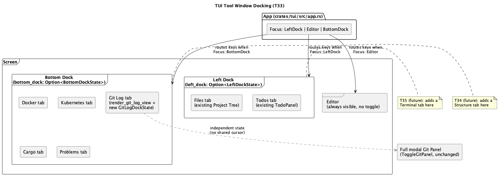

# TUI Tool Window Docking (T33)

## 1. Purpose

Replaces `ide-tui`'s current fixed two-column layout (Project Tree at a
hardcoded 30% width, Editor at 70%, with every other tool window — Git,
Debug, Cargo, Docker, Kubernetes, Todo, Problems, ...  — a full-screen
modal popup drawn on top) with a three-area layout:

- **Left dock** — a resizable, toggleable column left of the editor,
  holding **Files** (today's Project Tree) and **Todos** as tabs.
- **Editor** — unchanged, always visible, no toggle (there is nothing
  sensible to fall back to if it were hidden).
- **Bottom dock** — a resizable, toggleable panel below the editor
  (sharing the editor's column, not the full window width), holding
  **Docker**, **Kubernetes**, **Cargo**, **Problems**, and **Git Log** as
  tabs.

This is the first of three sequential phases agreed with the user for this
overall ask:
- **T33** (this doc): the docking/resize/toggle mechanics themselves, and
  migrating the five tool windows named above that already exist today.
- **T34** (future): a new "Structure" tab (LSP document-symbol outline,
  doesn't exist in `ide-tui` yet) added to the left dock.
- **T35** (future): a new "Terminal" tab (a real PTY-backed shell, doesn't
  exist in either frontend yet) added to the bottom dock.

Scoping T34/T35 out keeps this phase to "restructure how five *existing*
features are displayed and mounted," not "also build two new features."

**Explicitly out of scope for this doc**: every other overlay
(`palette`, `find`, `goto`, `notifications`, `search`, `go_to_file`,
`go_to_symbol`, `recent_files`, `bookmarks_popup`, `code_actions`,
`rename_popup`, `blame_popup`, `git_gutter_popup_line`, the full **Git
Panel** modal — branches/worktrees/staging/conflict-resolution/log-filters
— `keymap_popup`, `new_scratch_file`, `scratch_files`, the **Claude**
panel, `debug_panel` and its launch/config popups) stays exactly as it is
today: a full-screen modal popup, opened/closed the same way, with the
same keybindings. Only the five tool windows named above move into the
new dock groups; nothing else does. Mouse-drag resizing is also out of
scope — the user chose keyboard-only resizing for this phase.

## 2. Interface

### 2.1 `crates/tui/src/app.rs`

#### `Focus` gains a third variant and is renamed for accuracy

```rust
pub enum Focus {
    LeftDock,
    Editor,
    BottomDock,
}
```

`Focus::Tree` is renamed to `Focus::LeftDock` (every existing
`Focus::Tree` reference in `app.rs`/`ui.rs` updates to `Focus::LeftDock`)
— a plain rename, not a behavior change, done because the variant no
longer means "the tree has focus" now that the tree is one of two tabs in
a group; "the left dock has focus" is what it actually means once this
ships. `Focus::BottomDock` is new.

#### Dock visibility and tab state

```rust
/// `None` = dock hidden entirely (editor's column/row grows to fill the
/// freed space). `Some` = dock visible, holding which tab is active. This
/// is the same "presence is visibility" idiom `git_panel`/`todo_panel`/
/// `problems` already use elsewhere in this file, applied to a whole
/// group instead of a single popup.
pub(crate) left_dock: Option<LeftDockState>,
pub(crate) bottom_dock: Option<BottomDockState>,

/// Split ratios, persisted only for the process lifetime (not saved to
/// disk -- no existing settings-persistence mechanism in `ide-tui` this
/// would hook into, and the user didn't ask for persistence). Clamped to
/// `LEFT_DOCK_WIDTH_RANGE`/`BOTTOM_DOCK_HEIGHT_RANGE` on every change.
/// Meaningless while the corresponding dock is `None` -- kept anyway
/// rather than reset, so a re-toggled-open dock reappears at the size the
/// user last left it, matching every other "presence is visibility"
/// popup's existing convention of preserving what state it can across a
/// close/reopen.
pub(crate) left_dock_width_pct: u16,   // default 30, matches today's split
pub(crate) bottom_dock_height_pct: u16, // default 30

const LEFT_DOCK_WIDTH_RANGE: RangeInclusive<u16> = 15..=60;
const BOTTOM_DOCK_HEIGHT_RANGE: RangeInclusive<u16> = 15..=70;
const DOCK_RESIZE_STEP_PCT: u16 = 5;

#[derive(Default)]
pub(crate) struct LeftDockState {
    pub(crate) tab: LeftDockTab,
}

#[derive(Debug, Clone, Copy, PartialEq, Eq, Default)]
pub(crate) enum LeftDockTab {
    #[default]
    Files,
    Todos,
}

impl LeftDockTab {
    pub(crate) fn next(self) -> Self { /* Files -> Todos -> Files */ }
    pub(crate) fn previous(self) -> Self { /* same two states, reversed */ }
}

#[derive(Default)]
pub(crate) struct BottomDockState {
    pub(crate) tab: BottomDockTab,
}

#[derive(Debug, Clone, Copy, PartialEq, Eq, Default)]
pub(crate) enum BottomDockTab {
    #[default]
    Docker,
    Kubernetes,
    Cargo,
    Problems,
    GitLog,
}

impl BottomDockTab {
    pub(crate) fn next(self) -> Self { /* cycles all five, wrapping */ }
    pub(crate) fn previous(self) -> Self { /* same, reversed */ }
}
```

`LeftDockTab`/`BottomDockTab`'s `next`/`previous` are the same shape
`WorktreeAddField::next/prev` and `DebugConfigField` already establish
elsewhere in this crate — one match arm per variant, no shared helper
needed for two/five-variant enums this small.

`App::new` initializes `left_dock: Some(LeftDockState::default())` (the
left dock starts open, on the Files tab — matching today's always-visible
tree) and `bottom_dock: None` (the bottom dock starts **closed** — nothing
today occupies that space, so there is nothing for it to regress from
by defaulting closed; the doc's own examples in §5 show it being opened
on demand).

#### `Todo`/`Problems` visibility state is absorbed into `LeftDockState`/`BottomDockState`

`TodoPanelState` (`app.rs:277-279`, just `selected: usize`) and
`ProblemsState` (`app.rs:185-187`, same shape) stop being their own
`Option` fields on `App` — their one field (`selected: usize`) moves onto
`LeftDockState`/`BottomDockState` directly:

```rust
pub(crate) struct LeftDockState {
    pub(crate) tab: LeftDockTab,
    pub(crate) todos_selected: usize,
}
pub(crate) struct BottomDockState {
    pub(crate) tab: BottomDockTab,
    pub(crate) problems_selected: usize,
    // Docker/Kubernetes/Cargo already carry their own `selected`/cursor
    // fields inside their own always-alive data structs (see below) --
    // only Problems' cursor was ever a separate `Option`-wrapped struct.
}
```

`self.todo_panel: Option<TodoPanelState>` and `self.problems: Option<
ProblemsState>` are removed. `self.todo: TodoPanel` (the always-alive
search results/background-thread struct) is unchanged — it already
followed the correct "data survives, visibility is separate" idiom (§3
confirms this data was never actually deleted by a close today; this doc
just relocates where the *visibility* half of that idiom lives).

#### Docker/Kubernetes move to the same "always-alive data" idiom `Cargo` already uses

Today, `docker_panel: Option<DockerPanel>`/`k8s_panel: Option<K8sPanel>`
tie a fetched container/pod list *and* any in-flight `docker`/`kubectl`
subprocess receiver to the same `Option` that also means "is this
visible" — closing today (`Esc`) drops all of it. That was fine when
closing genuinely meant "I'm done with this," but a dock tab can be
switched away from and back to as casually as `Tab`-cycling, and losing
an in-flight fetch (or a fetched container list) every time the user
glances at another tab would make the dock version of these panels
noticeably worse than today's popup. So this phase also does the same
split `CargoPanel` already has:

```rust
pub(crate) docker: DockerPanel,   // was: docker_panel: Option<DockerPanel>
pub(crate) k8s: K8sPanel,         // was: k8s_panel: Option<K8sPanel>
```

`DockerPanel`/`K8sPanel`'s own fields (`tab`, `containers`, `images`,
`selected`, `in_flight`, `stream_rx`, `logs`, `error`, `confirm`, and
`K8sPanel`'s equivalents) are unchanged — only the field's type on `App`
changes from `Option<T>` to `T`, and `Default` is derived on `DockerPanel`/
`K8sPanel` themselves (or an explicit `impl Default` if any field doesn't
already derive it) so `App::new` can construct them unconditionally the
same way it already does `self.cargo: CargoPanel::default()`. Visibility
is now purely "is `bottom_dock` open, and is its `tab` currently
`Docker`/`Kubernetes`" — no separate bool needed on the panel structs
themselves. Any in-flight `stream_rx`/`in_flight` receiver keeps being
polled every frame regardless of which dock tab is currently showing
(the existing poll call sites in the main loop move from being gated on
`docker_panel.is_some()` to running unconditionally, mirroring how
`self.cargo`'s own background poll already runs regardless of
`cargo_panel_open`).

#### Git Log dock tab: a deliberately trimmed, always-alive cursor

The existing `render_git_log_view` (`ui.rs:1823`) already takes a `&
GitPanelState` and an arbitrary `Rect`, with no dependency on the popup
chrome (border/title/centering) that lives in its caller — it's already
reusable as-is. What it does depend on is a `GitPanelState`, which today
only exists while the full modal Git Panel is open (`git_panel: Option<
GitPanelState>`). The dock tab needs its own small, always-alive cursor,
separate from that popup's:

```rust
#[derive(Default)]
pub(crate) struct GitLogDockState {
    pub(crate) focus: GitPanelFocus, // only ever Graph or Diff here
    pub(crate) graph_selected: usize,
    pub(crate) diff_scroll: u16,
}
```

...living as `self.git_log_dock: GitLogDockState` (always alive, not
`Option` — it's cursor-only, same reasoning `GitPanelState` itself already
documents for why it doesn't need to be preserved-and-reset specially).
The render call site builds a throwaway `GitPanelState` from it:

```rust
render_git_log_view(frame, app, &GitPanelState {
    view: GitPanelView::Log,
    focus: app.git_log_dock.focus,
    graph_selected: app.git_log_dock.graph_selected,
    diff_scroll: app.git_log_dock.diff_scroll,
    ..GitPanelState::default()
}, area);
```

**Deliberate trim**: the dock tab is browse-only — select a commit
(`Graph` focus), view its diff (`Diff` focus), scroll. `GitPanelFocus::
Conflicts`/`Filter`, staging, branches, worktrees, and merge/conflict
resolution are **not** reachable from the dock tab; those still require
opening the full modal Git Panel via the existing, unchanged
`ToggleGitPanel` command. This avoids the much larger refactor of making
`handle_git_panel_key`'s entire precedence chain (branches popup,
worktrees popup, discard-confirm, conflict resolution, staging) reachable
without `git_panel.is_some()` — the same kind of explicit, justified scope
cut `git-worktrees.md`/`tui-git-worktrees.md` already made for "Switch
here"/"Open in New Window" (§1 of that doc), applied here to keep the
dock tab a quick glance rather than a second, always-mounted copy of the
entire Git Panel's modal state machine.

#### New `Action` variants and redefined existing ones

```rust
Action::ToggleLeftDock,        // new: show/hide the whole left dock group
Action::ToggleBottomDock,      // new: show/hide the whole bottom dock group
Action::GrowFocusedDock,       // new: widen/heighten whichever dock has focus
Action::ShrinkFocusedDock,     // new: narrow/shorten whichever dock has focus
Action::ToggleBottomDockFocus, // new: swap keyboard focus between BottomDock and Editor
```

`Action::ToggleTreeFocus` is renamed `Action::ToggleLeftDockFocus`, and its
behavior is redefined for the three-focus world (this is a real behavior
change, not a pure rename, unlike the `Focus::Tree` → `Focus::LeftDock`
field rename above):

```rust
fn toggle_left_dock_focus(&mut self) {
    self.focus = match self.focus {
        Focus::LeftDock => Focus::Editor,
        Focus::Editor | Focus::BottomDock => Focus::LeftDock,
    };
}
```

i.e. it always targets `LeftDock` specifically (never `BottomDock`),
matching its literal "Project" command-palette title (`ToggleProjectToolWindow`,
§2.2) — pressing it from `BottomDock` moves focus to `LeftDock`, not to
`Editor`. `Action::ToggleBottomDockFocus` is new, mirrors the same shape for
the other dock, and is what actually gets a keyboard-only user from
`BottomDock` back to `Editor` without closing the dock (there was no such
path before this doc: the old `Action::ToggleTreeFocus` only ever had two
foci to swap between, and re-running one of the `ToggleXPanel` commands from
§2.4 only closes the dock if it's already both showing that tab *and*
focused — otherwise it just re-focuses the dock, per its own exception
clause, so it can bring focus *to* a dock but was never a way *off* one):

```rust
fn toggle_bottom_dock_focus(&mut self) {
    self.focus = match self.focus {
        Focus::BottomDock => Focus::Editor,
        Focus::Editor | Focus::LeftDock => Focus::BottomDock,
    };
}
```

`Action::ToggleBottomDockFocus` is registered palette-only, no default
binding (§2.2) — there is no reference-IDE precedent for a *second*
tool-window-focus toggle keybinding the way `Ctrl+T` is a verified existing
binding for the first, so per `CLAUDE.md`'s "never invent a binding" rule it
ships bindable-but-unbound rather than guessed.

`Action::ToggleTodoPanel`/`ToggleDockerPanel`/`ToggleK8sPanel`/
`ToggleProblems` keep their existing `Action` names and command-table
entries (so existing muscle memory / the one existing default binding,
`Ctrl+P` for Problems, keeps working unchanged) but their *effect*
changes uniformly, per §3.

### 2.2 `crates/tui/src/commands.rs`

```rust
Command {
    id: "ToggleLeftDock",
    title: "Toggle Left Dock",
    // Palette-only -- "hide/show a whole dock group" has no JetBrains
    // tool-window-stretch precedent this project has verified with
    // confidence; per CLAUDE.md's keyboard-shortcuts rule, an
    // unverified binding is worse than none, so this registers with
    // no default and is reachable from the palette / user-rebindable.
    binding: None,
    action: Action::ToggleLeftDock,
},
Command {
    id: "ToggleBottomDock",
    title: "Toggle Bottom Dock",
    binding: None,
    action: Action::ToggleBottomDock,
},
Command {
    id: "GrowFocusedDock",
    title: "Grow Focused Dock Panel",
    binding: None,
    action: Action::GrowFocusedDock,
},
Command {
    id: "ShrinkFocusedDock",
    title: "Shrink Focused Dock Panel",
    binding: None,
    action: Action::ShrinkFocusedDock,
},
Command {
    id: "ToggleBottomDockFocus",
    title: "Toggle Bottom Dock Focus",
    binding: None,
    action: Action::ToggleBottomDockFocus,
},
```

`ToggleProjectToolWindow`'s existing entry (`id`, title "Project",
`Ctrl+T` binding) is unchanged except its `action` field now points at
the renamed `Action::ToggleLeftDockFocus` (redefined behavior, §2.1).
`ToggleTodoPanel`/
`ToggleDockerPanel`/`ToggleK8sPanel`/`ToggleProblems`/`ToggleGitPanel`'s
entries are entirely unchanged (same `id`, title, binding, `Action`
variant) — only what running that already-registered action *does*
changes (§3).

### 2.3 `crates/tui/src/ui.rs`

`render`'s current single `Layout::default().direction(Horizontal)
.constraints([Percentage(30), Percentage(70)])` two-way split is replaced:

```rust
fn render(frame: &mut Frame, app: &App, hits: &mut HitMap) {
    // ... existing top-level rows split into `body`/`status_area`, unchanged ...

    let left_width = app.left_dock.is_some().then_some(app.left_dock_width_pct);
    let columns = match left_width {
        Some(pct) => Layout::default()
            .direction(LayoutDirection::Horizontal)
            .constraints([Constraint::Percentage(pct), Constraint::Percentage(100 - pct)])
            .split(body),
        None => Layout::default()
            .constraints([Constraint::Percentage(0), Constraint::Percentage(100)])
            .split(body), // left column is zero-width; nothing renders into it
    };
    if let Some(dock) = &app.left_dock {
        render_left_dock(frame, app, dock, columns[0], hits);
    }

    let right_column = columns[1];
    let bottom_height = app.bottom_dock.is_some().then_some(app.bottom_dock_height_pct);
    let rows = match bottom_height {
        Some(pct) => Layout::default()
            .direction(LayoutDirection::Vertical)
            .constraints([Constraint::Percentage(100 - pct), Constraint::Percentage(pct)])
            .split(right_column),
        None => Layout::default()
            .constraints([Constraint::Percentage(100), Constraint::Percentage(0)])
            .split(right_column),
    };
    render_editor(frame, app, rows[0], hits);
    if let Some(dock) = &app.bottom_dock {
        render_bottom_dock(frame, app, dock, rows[1], hits);
    }

    render_status(frame, app, status_area);
    // ... every existing `if app.XXX.is_some() { render_XXX(...) }` overlay
    // check below this point is unchanged verbatim (§1's scope list) ...
}
```

(Exact `Constraint`/zero-width handling above is illustrative of the
behavior required — a `Percentage(0)` split producing a zero-width `Rect`
that nothing renders into, versus an implementer instead choosing to skip
the split call entirely and hand `body`/`right_column` straight through
when the corresponding dock is `None`, are equivalent and either is
acceptable; the requirement is "hidden dock takes zero space, the
sibling area gets all of it," not a specific `ratatui` call shape.)

`render_left_dock`/`render_bottom_dock` (new) each render a one-row tab
strip above their content — marking the focused tab with `[brackets]`
around its title, a convention distinct from both the editor tab strip's
reverse-video highlight (`render_tab_strip`) and `render_debug_panel`'s
`section_title` closure's `* ` prefix (`ui.rs:1325-1326`), chosen because
this strip packs multiple short labels onto one line where a color-only
cue would be lost on a monochrome terminal — then dispatch to the active
tab's existing render function:

- `LeftDockTab::Files` → the existing `render_tree` body (called with the
  dock's content `Rect`, everything below the new tab-strip row).
- `LeftDockTab::Todos` → the existing Todo-panel rendering, adapted to
  read `dock.todos_selected` instead of the old `app.todo_panel.as_ref()
  .unwrap().selected`.
- `BottomDockTab::Docker`/`Kubernetes`/`Cargo` → each panel's existing
  rendering, adapted to always read from `app.docker`/`app.k8s`/
  `app.cargo` (no longer `Option`-unwrapped).
- `BottomDockTab::Problems` → the existing Problems rendering, adapted to
  read `dock.problems_selected`.
- `BottomDockTab::GitLog` → `render_git_log_view` via the synthesized
  `GitPanelState` shown in §2.1.

Each existing panel's render function loses whatever popup chrome
(centered `Rect` math, its own `Block`/border/title, `Clear`) it drew for
itself as a full-screen popup — that chrome now belongs to
`render_left_dock`/`render_bottom_dock`'s shared tab-strip-plus-content
frame instead, the same way `render_git_log_view` already never drew its
own chrome even before this doc.

### 2.4 `crates/tui/src/app.rs` — key routing

`handle_key`'s existing linear precedence chain (§ survey item 8) is
unchanged in shape — every existing `if self.XXX.is_some() { return self.
handle_XXX_key(key) }` check for the overlays listed in §1's "out of
scope" list stays exactly where it is, in exactly the same order. The
final `match self.focus { ... }` fallthrough (i.e., dock-tab keys are the
*lowest* priority, same as today's bare `Tree`/`Editor` focus dispatch was)
gains a `BottomDock` arm alongside the renamed `LeftDock` one (`Editor`'s
arm is unchanged) — this ordering matters: every existing modal popup
(find, palette, code actions, etc.) must still intercept keys before dock
routing ever sees them, exactly as today:

```rust
match self.focus {
    Focus::LeftDock => self.handle_left_dock_key(key),
    Focus::Editor => { /* existing editor key handling, unchanged */ }
    Focus::BottomDock => self.handle_bottom_dock_key(key),
}
```

`handle_left_dock_key`/`handle_bottom_dock_key` each: check `Tab`/
`BackTab` first (cycle `LeftDockTab`/`BottomDockTab`, same convention
`handle_debug_panel_key` already uses for its own three sections), then
delegate every other key to whichever existing per-panel key handler
matches the active tab, with one new handler for the one tab that has no
existing per-panel key handler to delegate to:

- `LeftDockTab::Files` → the existing tree key handler.
- `LeftDockTab::Todos` → the existing Todo-panel key handler, adapted to
  `dock.todos_selected` (§2.1).
- `BottomDockTab::Docker`/`Kubernetes`/`Cargo` → the existing
  `handle_docker_panel_key`/`handle_k8s_panel_key`/`handle_cargo_panel_key`,
  adapted to no longer require `docker_panel.is_some()`/`k8s_panel.is_some()`
  as a precondition since `self.docker`/`self.k8s` are now always alive.
- `BottomDockTab::Problems` → the existing Problems key handler, adapted to
  `dock.problems_selected`.
- `BottomDockTab::GitLog` → **new** `handle_git_log_dock_key(&mut self, key:
  KeyEvent)`, since delegating to the existing `handle_git_panel_key`
  is explicitly ruled out (§2.1's "deliberate trim" — that function's
  precedence chain assumes `git_panel.is_some()` and reaches
  branches/worktrees/staging/conflicts/`Filter`, none of which the dock tab
  exposes) and no other existing handler covers commit-graph browsing. Its
  entire body: `Up`/`Down` move `graph_selected` (saturating, clamped to the
  current commit list length — same idiom as every other list cursor in this
  crate, e.g. `branches_popup.selected`); `[`/`]` swap
  `self.git_log_dock.focus` between `GitPanelFocus::Graph` and `::Diff`;
  `Enter` while `focus == Graph` also jumps straight to `::Diff` (selecting
  the highlighted commit first); `Up`/`Down` while `focus == Diff` scroll
  `diff_scroll` instead (saturating, no clamp needed at the top since `0` is
  already the floor — `ratatui`'s scroll widgets clamp an over-large value
  themselves at render time, same as every other scrollable panel already in
  this crate). No other key does anything in this handler.

  **Revision (post-implementation):** the original text of this bullet
  bound the Graph/Diff toggle to `Tab`/`BackTab` and had this handler return
  `bool` so `handle_bottom_dock_key`'s own `Tab`/`BackTab` dock-tab-cycling
  could fall through to it when unconsumed. That never matches the actual
  control flow above (§2.4's own `match self.focus { ... }` box): `handle_
  bottom_dock_key` matches `Tab`/`BackTab` for dock-tab cycling *before*
  delegating to any per-tab handler at all, unconditionally, for every tab
  — there is no fallthrough path, bool-returning or otherwise, by which a
  per-tab handler ever sees a `Tab`/`BackTab` key press. Binding GitLog's
  own toggle to the same keys made it permanently unreachable. Rebound to
  `[`/`]` instead, the same fix already applied to Docker's/K8s's internal
  sub-view switches for the identical reason (this section, Docker/K8s
  bullet above) — this brings GitLog in line with a pattern the other two
  tabs already had to adopt, rather than inventing a third mechanism.

`Ctrl+T` (`ToggleLeftDockFocus`) and `ToggleBottomDockFocus` (§2.1, no
default binding) still intercept **before** this fallthrough is reached, in
`binding_for`'s existing lookup, same as today.

`ToggleTodoPanel`/`ToggleDockerPanel`/`ToggleK8sPanel`/`ToggleProblems`
(run from `run_action`, reached only once the modal-popup precedence
chain above has already let the key through) each redefine their existing
body to:

1. Ensure the owning dock (`left_dock` for Todos, `bottom_dock` for the
   other three) is `Some` — constructing a fresh default if it was
   `None`.
2. Set that dock's `tab` to the one this command names.
3. Set `self.focus` to `LeftDock`/`BottomDock` accordingly.
4. **Exception**: if the dock was already open **and** already showing
   that exact tab **and** `self.focus` already equals that dock, instead
   close the dock (`= None`) and return focus to `Editor` — this
   preserves today's simple "press it again to close" toggle behavior for
   the common case of a command being bound to a single tab, rather than
   silently becoming an open-only action once tabs are involved.

`ToggleGitPanel` (the full modal Git Panel) is entirely unchanged — it has
no relationship to `BottomDockTab::GitLog`; both can be open
simultaneously, and neither's state affects the other's (§4).

## 3. Behaviour & edge cases

- **Growing/shrinking**: `GrowFocusedDock`/`ShrinkFocusedDock` are a no-op
  while `self.focus == Focus::Editor` (there's no "focused dock" to
  resize) and while the corresponding dock is `None` (nothing visible to
  resize). While `Focus::LeftDock`, they adjust `left_dock_width_pct` by
  `DOCK_RESIZE_STEP_PCT`, clamped to `LEFT_DOCK_WIDTH_RANGE`; while
  `Focus::BottomDock`, they adjust `bottom_dock_height_pct` the same way
  against `BOTTOM_DOCK_HEIGHT_RANGE`. Hitting a clamp bound is a silent
  no-op past that point (matches every other saturating/clamped cursor
  adjustment already in this crate, e.g. `branches_popup.selected`'s
  `saturating_sub`).
- **Toggling a dock closed while it holds keyboard focus** moves focus to
  `Editor` (never leaves `self.focus` pointing at a now-`None` dock, which
  `handle_key`'s `match self.focus` would otherwise have no arm's content
  to route to meaningfully). Toggling a dock closed while the *other* dock
  or the editor has focus leaves focus exactly where it was.
- **`Tab`/`BackTab` while a dock has focus** cycle only that dock's own
  tab set (two for the left dock, five for the bottom) and never affect
  the other dock or the editor.
- **Background work continues regardless of tab/visibility**: `self.cargo`
  (already true today), `self.docker`, `self.k8s`, and `self.todo`'s
  search thread all keep running/polling every frame whether or not their
  owning dock is open or their tab is the active one — switching to
  `LeftDockTab::Todos` while a search is still in flight shows whatever
  partial `results` exist so far, exactly like today's popup already
  does; switching away and back never restarts or loses that work.
- **`GitLogDockState` never resets** on dock-tab switches (no equivalent
  of `close_worktrees_popup`'s "reset to default on close" — there is no
  "close" for a permanently-mounted tab's cursor, only "not currently the
  active tab," so leaving and returning to `BottomDockTab::GitLog` shows
  the same commit/scroll position as before).
- **The full Git Panel and the `GitLog` dock tab have independent cursor
  state, but share the underlying commit/diff cache.** Each has its own
  `graph_selected`/`diff_scroll` (`GitPanelState` vs. `GitLogDockState`),
  so scrolling or navigating in one never moves the other's cursor. They
  are *not*, however, fully independent: both read and write
  `self.git.selected_commit`/`graph`/diff content, the same shared cache
  `toggle_git_panel` already left untouched across opens/closes before
  this doc's feature existed — so selecting a commit in one does change
  what the other shows as "the selected commit" if opened next (its own
  cursor position stays put, but the underlying selection/diff it would
  jump to on `Enter`, or already display in `Diff` focus, is shared). This
  is a deliberate consequence of §2.1's scope trim, not an oversight — a
  future phase could give each surface its own independent copy of that
  cache, or unify the two entirely, but doing so now would mean solving
  the much larger "make the whole modal Git Panel state machine
  permanently mounted" problem this doc explicitly declines to take on.
- **Resizing never lets a dock shrink the editor to zero or negative
  space**: `LEFT_DOCK_WIDTH_RANGE`/`BOTTOM_DOCK_HEIGHT_RANGE`'s upper
  bounds (60%/70%) are chosen so the editor always retains a usable
  minimum share of the screen even at maximum dock size; there is no
  scenario (short of an absurdly narrow terminal `ratatui` already can't
  render sensibly) where the editor's `Rect` collapses to zero width or
  height as a result of dock resizing alone.
- **Mouse clicks** on dock tab-strip rows or panel content follow this
  crate's existing `HitMap`-based click-routing convention (T-mouse
  support) unchanged in mechanism — `render_left_dock`/`render_bottom_dock`
  register hit regions for their tab strip the same way every other
  clickable row in this crate already does via the `hits` parameter
  already threaded through `render_tree`/etc. Mouse-driven *resize*
  (dragging a border) is explicitly out of scope (§1).

## 4. Constraints & invariants

- `Focus` always has exactly one active variant; `handle_key`'s bottom-of
  -chain `match self.focus` must have an arm for all three, with no
  wildcard `_ => {}` that could silently swallow a dock's keys.
- A dock's `Option` state and its `_width_pct`/`_height_pct` field are
  independent — resizing a hidden dock's stored percentage (impossible
  today, since resize is gated on that dock having focus, and a hidden
  dock can never have focus) is not a reachable state, but if a future
  change ever made it reachable, the stored percentage must still only
  take visual effect once the dock is shown again.
- `self.docker`/`self.k8s` being always-alive (no longer `Option`) means
  any code that used to check `docker_panel.is_some()` as a precondition
  for polling `stream_rx`/`in_flight` must be updated to poll
  unconditionally — leaving a stale `is_some()`-style guard anywhere
  would silently stop background docker/kubectl output from ever
  reaching `self.docker.logs`/`.containers` again once the bottom dock is
  closed, a regression from today's behavior (today, `is_some()` being
  false already means the whole panel — including its background state —
  was dropped, so there was nothing to poll; post-this-doc, `is_some()`
  no longer exists for these two fields at all, so every such call site
  needs updating, not just gating differently).
- No new `ide-core`/`ide-lsp`/`ide-dap` API — this is a `crates/tui/**`
  -only restructuring of already-existing data flows.
- Not a security-sensitive path per `CLAUDE.md`'s own list **except**:
  `crates/tui/src/docker_panel.rs` and `crates/tui/src/k8s_panel.rs` are
  already named on it (they shell out to `docker`/`kubectl`) — this
  doc's changes to those two files are limited to the `Option<T>` → `T`
  field-type change and its mechanical consequences (removing the old
  `is_some()` gates, per the invariant above); no new subprocess
  invocation, argument construction, or destructive action is introduced
  by this doc. A `hacker` pass is still expected for this run's diff
  against those two files per `CLAUDE.md`'s unconditional file-level
  listing, the same reasoning already established for `git_panel.rs` in
  `docs/features/tui-git-worktrees.md` §4/its review — the pass should
  focus on confirming nothing about the *existing* subprocess/argument
  handling changed, not re-auditing it from scratch.
- `crates/tui/src/git_panel.rs` is also touched (the new
  `GitLogDockState`/synthesized-`GitPanelState` render path) and is
  already unconditionally on `CLAUDE.md`'s list for unrelated reasons
  (§4 of `tui-git-worktrees.md`) — same "confirm nothing new, don't
  re-audit the whole file" scope applies.

## 5. Examples

```
1. App starts. left_dock = Some(LeftDockState { tab: Files, .. }),
   bottom_dock = None. Screen shows: Files tree | Editor, full height --
   visually identical to today's layout.

2. User runs "Kubernetes" from the palette (ToggleK8sPanel, unchanged
   command).
   -> bottom_dock becomes Some(BottomDockState { tab: Kubernetes, .. }).
      focus becomes BottomDock. Screen now shows three areas: Files tree
      (left) | Editor (top-right) / Kubernetes (bottom-right).

3. User presses Tab (focus is BottomDock).
   -> bottom_dock.tab cycles Kubernetes -> Docker (or whatever
      `BottomDockTab::next` defines as Kubernetes' successor). The
      Kubernetes fetch already in flight (if any) keeps running in the
      background, untouched.

4. User presses Ctrl+T (ToggleLeftDockFocus, unchanged binding, redefined
   behavior).
   -> focus moves from BottomDock to LeftDock (ToggleLeftDockFocus always
      targets LeftDock specifically, never a cyclic "next focus" -- §2.1).
      Pressing Ctrl+T again (focus is now LeftDock) moves focus to Editor.

4b. User runs "Toggle Bottom Dock Focus" from the palette while focus is
    Editor and bottom_dock is Some (still open from step 2/3).
    -> focus moves to BottomDock, landing back on whichever tab was last
       active there (Docker, from step 3) with its cursor untouched. This
       is the keyboard-only path back into a dock that Ctrl+T alone cannot
       reach, since Ctrl+T only ever targets LeftDock (§2.1).

5. User runs "Toggle Bottom Dock" from the palette.
   -> bottom_dock becomes None. The Docker/Kubernetes/Cargo/Problems/
      GitLog tabs are no longer visible; the editor's row grows to fill
      the freed vertical space. focus (if it was BottomDock) moves to
      Editor. All background docker/kubectl/cargo work keeps running
      regardless.

6. User runs "Git Worktrees..." (unrelated, unchanged command) -- opens
   the full modal Git Panel, independent of BottomDockTab::GitLog's own
   state, exactly as if this doc had never shipped.
```

## 6. Dependencies & integration points

- `crates/tui/src/app.rs`: `Focus` rename + new variant; new
  `LeftDockState`/`BottomDockState`/`LeftDockTab`/`BottomDockTab`/
  `GitLogDockState`; `left_dock`/`bottom_dock`/`left_dock_width_pct`/
  `bottom_dock_height_pct`/`git_log_dock` fields on `App`; removal of
  `todo_panel`/`problems` `Option` fields (state relocated); `docker_panel`/
  `k8s_panel` field type change from `Option<T>` to `T`; new
  `Action::ToggleLeftDock`/`ToggleBottomDock`/`GrowFocusedDock`/
  `ShrinkFocusedDock`/`ToggleBottomDockFocus`, redefined
  `Action::ToggleLeftDockFocus` (renamed from `ToggleTreeFocus`, three-focus
  behavior per §2.1); new `handle_left_dock_key`/`handle_bottom_dock_key`/
  `handle_git_log_dock_key`; redefined bodies for `ToggleTodoPanel`/
  `ToggleDockerPanel`/`ToggleK8sPanel`/`ToggleProblems`.
- `crates/tui/src/commands.rs`: five new command entries, one renamed
  `Action` reference on the existing `ToggleProjectToolWindow` entry.
- `crates/tui/src/ui.rs`: `render`'s top-level layout restructured per
  §2.3; new `render_left_dock`/`render_bottom_dock`; every migrated
  panel's render function loses its own popup chrome.
- `crates/tui/src/docker_panel.rs`/`k8s_panel.rs`: `Default` derived (or
  implemented) on `DockerPanel`/`K8sPanel`; internal logic otherwise
  unchanged.
- `crates/tui/src/git_panel.rs`: no changes to `GitPanel` itself — only
  `app.rs`'s new `GitLogDockState` and `ui.rs`'s synthesized-`
  GitPanelState` render call site are new, both outside this file.
- No `ide-core`/`ide-lsp`/`ide-dap` changes.
- `hacker` is expected for this run against `docker_panel.rs`/
  `k8s_panel.rs` (already on `CLAUDE.md`'s list) and `git_panel.rs`
  (same), per §4.
- Sets up, but does not implement, T34 (`LeftDockTab::Structure` slots in
  next to `Files`/`Todos`) and T35 (`BottomDockTab::Terminal` slots in
  next to the five tabs here) — both future docs should extend
  `LeftDockTab`/`BottomDockTab`'s enums and `next`/`previous` rather than
  introduce a parallel mechanism.

## 7. Diagram



## Revision notes

Per `rev`'s first review pass (three required changes):

1. **`Ctrl+T`'s three-focus behavior was left to "the implementer to define
   sensibly."** Now pinned down explicitly (§2.1): `ToggleLeftDockFocus`
   always targets `LeftDock` specifically (`BottomDock`/`Editor` → `LeftDock`,
   `LeftDock` → `Editor`), matching its "Project" command title.
2. **No documented way to move focus from `BottomDock` to `Editor`.** Added
   `Action::ToggleBottomDockFocus` (§2.1, §2.2), a palette-only mirror of the
   redefined `ToggleLeftDockFocus` for the bottom dock, and a new example
   4b (§5) showing it in use.
3. **The `GitLog` dock tab's key handling had no named handler** — §2.4
   previously said to delegate to "whichever existing per-panel key handler
   matches the active tab" without naming one for `GitLog`, while
   simultaneously ruling out reusing `handle_git_panel_key`. Added a fully
   specified `handle_git_log_dock_key` (§2.4: `Up`/`Down` move
   `graph_selected` or scroll `diff_scroll` depending on `focus`,
   `Tab`/`BackTab`/`Enter` swap `focus` between `Graph`/`Diff`, everything
   else falls through unconsumed).

Two devil's-advocate points from the same review (fixed two docking slots
instead of freely-reassignable tool windows; `GrowFocusedDock`/
`ShrinkFocusedDock` acting on whichever dock has focus rather than four
separate directional commands) were raised as non-blocking; the user
reviewed both and agreed to keep the doc as designed on both points — no
change made for either.

Round 2 (one Low finding): §2.4's opening paragraph referred to "three new
checks... inserted before" the `match self.focus` fallthrough, but no three
checks were ever enumerated there — the fallthrough itself just gains a
`BottomDock` arm. Reworded to say that directly.

Round 4 (post-implementation corrections, found only once the approved
design was actually built and exercised by tests — not from a `rev` pass):

4. **`GitLog`'s `Tab`/`BackTab` Graph/Diff toggle was permanently
   unreachable.** §2.4 bound it to the same `Tab`/`BackTab` keys
   `handle_bottom_dock_key` already consumes, unconditionally, to cycle
   dock tabs *before* delegating to any per-tab handler — there was never a
   fallthrough path by which a per-tab handler could see those keys, so the
   `bool`-returning "falls through unconsumed" design this section
   originally described didn't match the control flow implemented
   elsewhere in the same doc. Rebound to `[`/`]`, matching the fix already
   applied to Docker's/K8s's own internal sub-view switches for the
   identical reason. §2.4's `GitLog` bullet updated in place with the
   correction inline.
5. **Docker's/K8s's confirm popups (plus K8s's scale-input prompt and
   context/namespace picker) could never be cancelled with `Esc`.** Once
   these panels stopped being modals in the `handle_key` precedence chain
   (§2.4), a plain `Esc` — already bound globally to `CollapseSelections`,
   `commands.rs` — won every race against ever reaching their own
   confirm-mode `Esc` handling, since the global keymap lookup runs before
   the `self.focus` fallthrough these panels are now reached through.
   Fixed by adding two narrow checks back into `handle_key` (and mirrored
   in `any_popup_open`), ahead of the keymap lookup: while the Docker tab
   is showing and its `confirm` is `Some`, or the Kubernetes tab is showing
   and its `confirm`/`scale_input`/`picker` is `Some`, route directly to
   that panel's key handler, the same priority every other true modal in
   the chain already gets. This restores exactly the nested-modal behavior
   those panels had before this feature, without reintroducing modality
   for the tabs themselves.

Neither correction changes any interface signature from earlier rounds —
both are implementation-detail fixes to keep the doc accurate against what
was actually necessary to build a working feature, surfaced here per
`CLAUDE.md`'s "fix all findings" convention rather than left silently
diverging.

### Round 5 (post-`rev`, two doc/comment corrections)

`rev` (non-blocking `[quality]`/`[docs]` findings) caught two places where
this doc, or a code comment written against it, claimed something the
actual implementation doesn't do:

1. **The tab-strip convention.** §2.3 originally said
   `render_left_dock`/`render_bottom_dock` reuse `render_debug_panel`'s
   `* `-prefix convention; the actual implementation uses `[brackets]`
   instead, and the matching `ui.rs` doc comment incorrectly claimed this
   was reusing "the bracketed-active-tab convention this file's tab strip
   already establishes for editor tabs" — no such convention existed
   before this diff (the editor tab strip uses reverse-video highlighting,
   not brackets). Both the doc and the code comment now describe brackets
   as the actual, deliberately new convention, with the rationale (packing
   multiple short labels onto one line, where a color-only cue would be
   lost on a monochrome terminal).
2. **Git Panel / GitLog dock independence.** The original §3 bullet
   claimed the two are "fully independent." Verified against the code:
   only each surface's own cursor bookkeeping (`graph_selected`/
   `diff_scroll`) is independent — both still read and write the same
   shared `self.git.selected_commit`/`graph`/diff cache, a pre-existing
   sharing pattern this feature adds a second consumer to rather than
   introduces. The bullet now describes this accurately instead of
   overclaiming isolation that doesn't exist.

Neither correction changes behavior — both are doc/comment-accuracy fixes.
